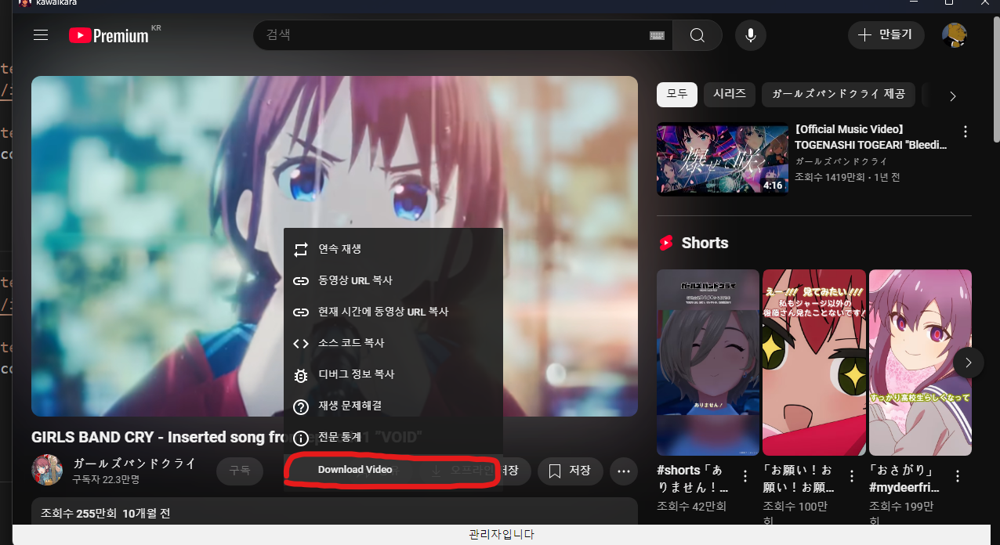

# *KAWAIKARA*

<p align="center">
  
</p>
<p align="center">
<strong>KAWAIKARA</strong> is
<strong>OTT-Viewer</strong> based on 
<strong>Electron</strong>
</p>


 [](./README.MD)
[](./README_KR.MD)
 [](./README_JP.MD)


[](https://discord.gg/JJs974BX45)
[](https://github.com/fabyday/kawaikara/releases/2.1.2)

[](https://github.com/fabyday/kawaikara/releases/latest)
[](https://github.com/fabyday/kawaikara/releases)


I'm enjoying Discord broadcasting with my friends. and its service fit to me very weeelll. However there are few problems. Discord acquires only single program window and many streaming services use DRM. watching OTT-streaming by Browser may be an alternative way. But Wathching By Browser waste screen area(I just want fullscreen mode but not actually fullscreen. I just want to remove address bar and scrollbar and other UIs.) That's why I decide to develop super-duper-tight&fit OTT-streaming viewer.


## Features

* **PiP** (Picture in Picture)
* **fullscreen** to **user fixed window**
* Watching OTT with friends on Discord
* Download Youtube Video Easily
* **MacOS** Suppport (experimental)

## Available for 
- OTT
  - **Netflix**
  - **Lafetel**
  - **Youtube**
  - **Disney plus**
  - **Amazonprime**
  - **Wavve**
  - **Watcha**
  - **Coupangplay** 
  - **Tving**
  - **Crunchyroll**
  - **AppleTV** 
  - **RIDIBooks** 
- Music
  - **Apple music** 
  - **Youtube music** 
  - **Spotify** 
- streaming
  - **Chzzk**
  - **Twitch**


# Install Guide


### Windows10/11
Download from the [**Releases**](https://github.com/fabyday/kawaikara/releases) page
### MacOS
See the README in the [**homebrew-kawaikara**](https://github.com/fabyday/homebrew-kawaikara) repository

## Usage 

<p align="center">  
    
</p>
<p align="center">
  You can Use <Strong>Tab</Strong>  key to Open Menubar
<br>
</p>

1. Click ```Tab``` key to Open Menu.
2. Select service what you want.
3. Enjoying Service!

* Open Menu : ```Tab```
* Fullscreen On/Off : ```Alt+Enter```

**Open Download Directory** : ```Menu > Options > Download Directory```


## Rich Presence On Discord
<p align="center">
    

<p align="center">
     <Strong>Use Kawai Rich Presence on Discord</strong>
</p>
</p>

# Examples
<p align="center">
  <a href="https://youtu.be/rQtkKzEkYrI">
    
  </a>
</p>
<p align="center">
   <strong>streaming video examples</strong> <a href="https://youtu.be/rQtkKzEkYrI">
</a>
</p>

<p align="center">
  <a href="https://youtu.be/E042q0tFjSc">
    
  </a>
</p>
<p align="center">
   <strong>streaming video examples(MacOS)</strong> <a href="https://youtu.be/E042q0tFjSc">
</a>
</p>


<p align="center">  
<br>
    
    
</p>
<p align="center">
  <Strong>Laftel</Strong> default mode(left), full screen mode(right) 
</p>

<p align="center">  
    
</p>

<p align="center">
    <Strong>Netflix</strong> Rebel Moon.
</p>

<p align="center">  
    
</p>
<p align="center">
  <Strong>discord streaming<br></Strong> (default mode)
</p>


<p align="center">  
    
</p>
<p align="center">
  <Strong>discord streaming<br></Strong> (full screen mode)
</p>

<p align="center">  
    
</p>
<p align="center">
  <Strong>Download Youtube Video<br></Strong>(Right Click)
</p>

<p align="center">  
    
</p>
<p align="center">
  <Strong>Downloaded Video in Download Directory<br></Strong>(see Below)
</p>


<p align="center">
  <a href="https://youtu.be/KMCZB3F6c1I">
    
  </a>
</p>
<p align="center">
   <Strong>Youtube Download Example</strong> <a href="https://youtu.be/KMCZB3F6c1I">
</a>
</p>


## DRM-problem

Yes, *Electron* doesn't support _CDM_ due to the Liscense. In this reason, I couldn't directly use *Electron* frameworks. To support DRM product, I used **castlab**'s electron fork.


## build your own OTT-viewer(Windows 10/11)

This is simple way. Just follow my way. you must prepare *nodejs* environment. I recommend to use *nvm*(node version manager) and *yarn*.


before starting. we need to register *castlab* that organization(company ? or not...) provides *CDM* certification.


install ```conda``` environment
sign up castlab 
```shell
conda create -n test_env python=3.10
conda activate test_env
pip install castlabs_evs

#make castlabs account
python -m castlabs_evs.account signup

#after signup. login with your computer.
python -m castlabs_evs.account reauth -A ${your_account} -P ${your password}

ok. then it's done.
```

## Make available for disord Rich presence

crete ```.env``` file in your root repository.
```
DISCORD_APP_ID=${write App ID here.}
DISCORD_PUB_KEY=${write App public key here.}
```


## Publish To your Own Repository
You must run this script on powershell.(funtion that generating certification file use powershell functions.)
```shell 
yarn install # install all deps in package.json 
yarn make-cert:win # make your self-signed-cert(offical cert is too expensive...) 
# package_local_only rename to 
yarn build # it's all done. baby.
```

## build your own OTT-viewer(MacOS)


install ```conda``` environment
sign up castlab 
```shell
conda create -n test_env python=3.10
conda activate test_env
pip install castlabs_evs

#make castlabs account
python -m castlabs_evs.account signup

#after signup. login with your computer.
python -m castlabs_evs.account reauth -A ${your_account} -P ${your password}

ok. then it's done.
```


You must run this script on powershell.(funtion that generating certification file use powershell functions.)
```shell 
yarn install # install all deps in package.json 
yarn make-cert:mac # make your self-signed-cert(offical cert is too expensive...) 
# package_local_only rename to 
yarn build # it's all done. baby.
```


## MIT License

Copyright (c) 2024 fabyday

Permission is hereby granted, free of charge, to any person obtaining a copy
of this software and associated documentation files (the "Software"), to deal
in the Software without restriction, including without limitation the rights
to use, copy, modify, merge, publish, distribute, sublicense, and/or sell
copies of the Software, and to permit persons to whom the Software is
furnished to do so, subject to the following conditions:

The above copyright notice and this permission notice shall be included in all
copies or substantial portions of the Software.

THE SOFTWARE IS PROVIDED "AS IS", WITHOUT WARRANTY OF ANY KIND, EXPRESS OR
IMPLIED, INCLUDING BUT NOT LIMITED TO THE WARRANTIES OF MERCHANTABILITY,
FITNESS FOR A PARTICULAR PURPOSE AND NONINFRINGEMENT. IN NO EVENT SHALL THE
AUTHORS OR COPYRIGHT HOLDERS BE LIABLE FOR ANY CLAIM, DAMAGES OR OTHER
LIABILITY, WHETHER IN AN ACTION OF CONTRACT, TORT OR OTHERWISE, ARISING FROM,
OUT OF OR IN CONNECTION WITH THE SOFTWARE OR THE USE OR OTHER DEALINGS IN THE
SOFTWARE.


