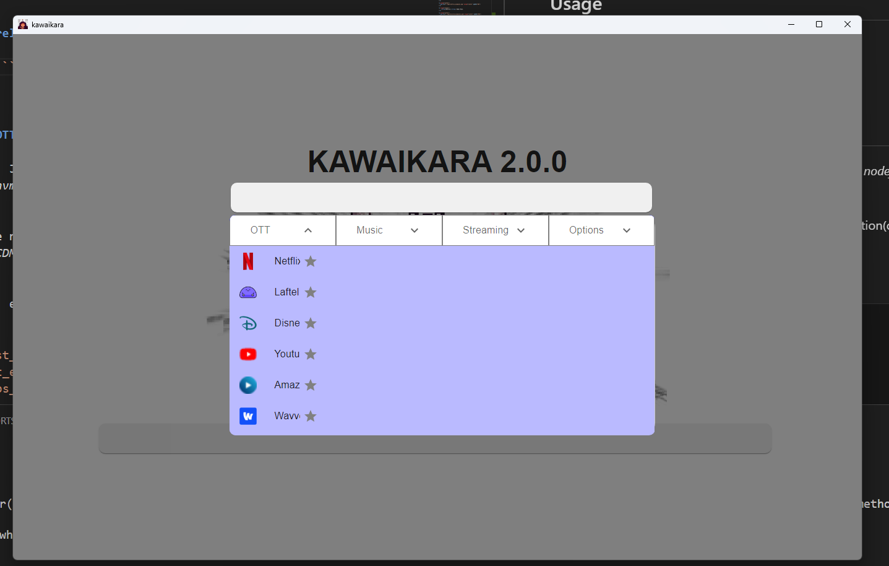
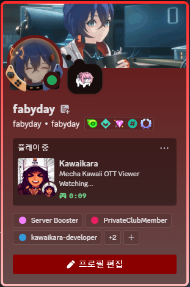
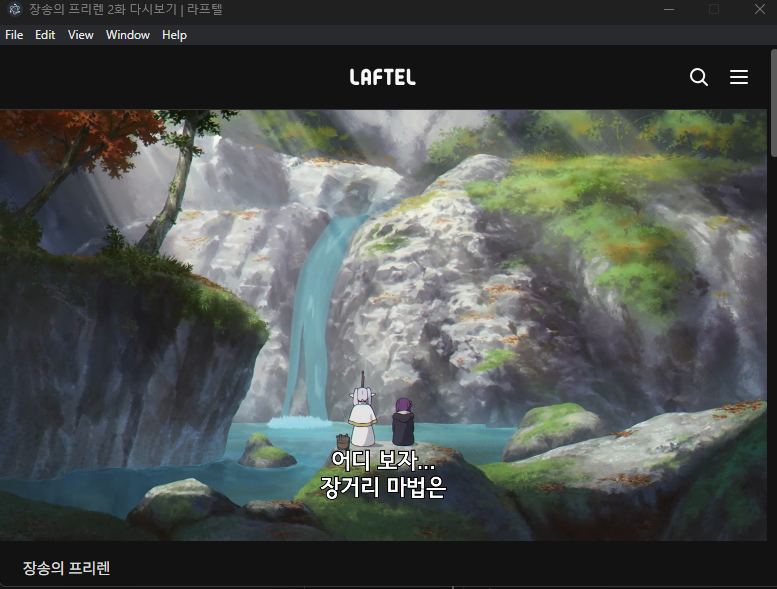
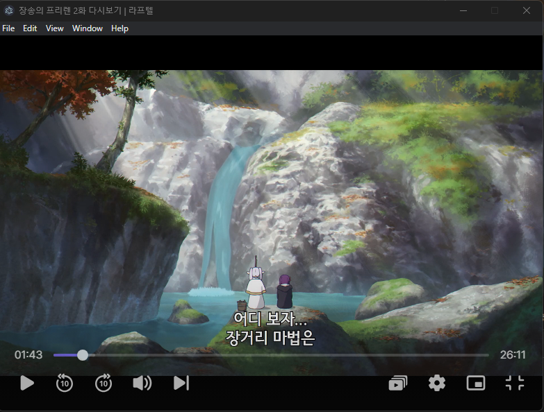
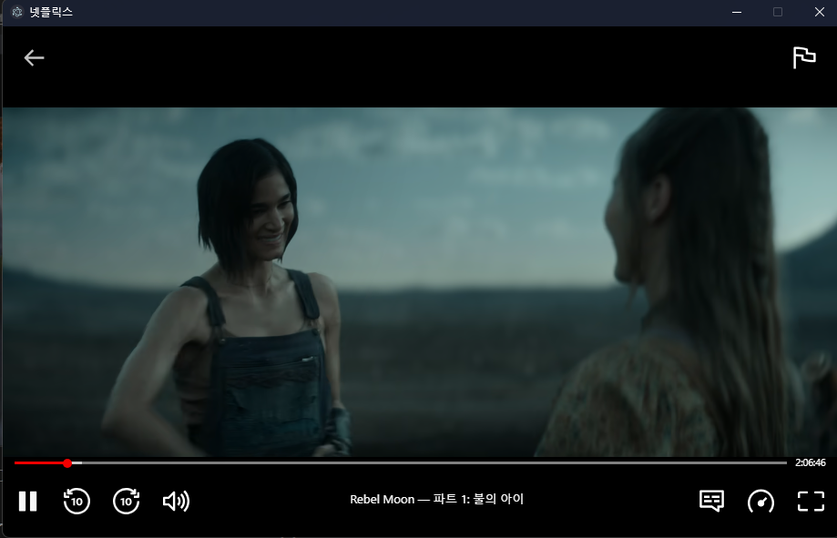
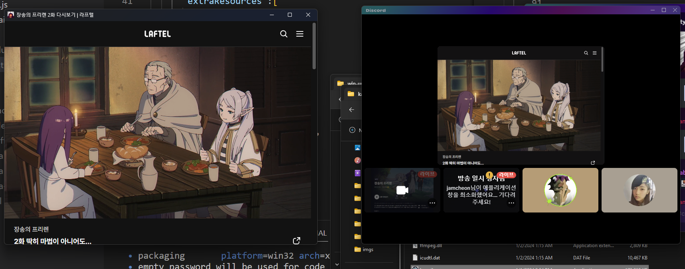
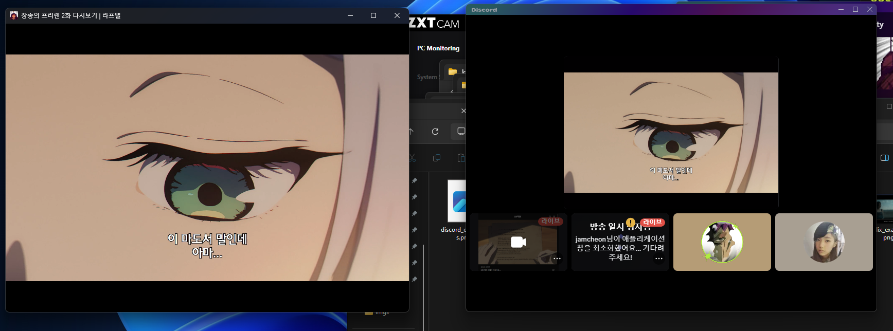
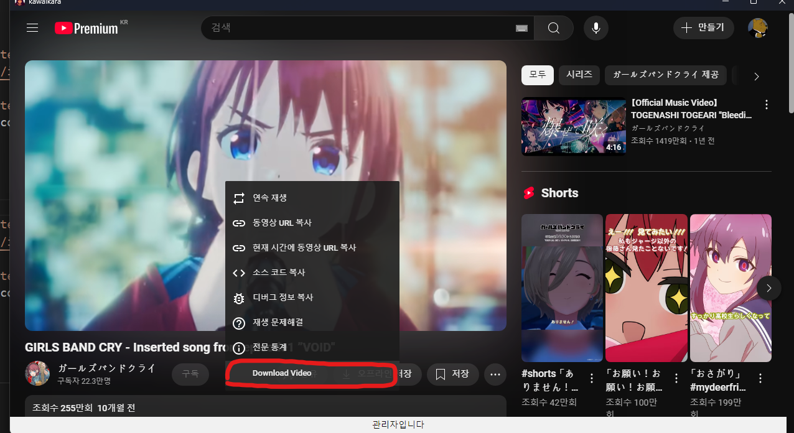
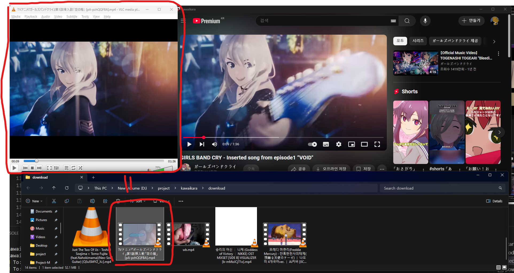

# *カワイイカラ*

<p align="center">
  
</p>
<p align="center">
  <strong>KAWAIKARA</strong>は
  <strong>Electron</strong>をベースにした
  <strong>OTTビューア</strong>です
</p>

  [](./README.MD)
 [](./README_KR.MD)
  [](./README_JP.MD)
 
 
 
 
 
 [](https://discord.gg/JJs974BX45)
 [](https://github.com/fabyday/kawaikara/releases/2.1.2)
 
 [](https://github.com/fabyday/kawaikara/releases/latest)
 [](https://github.com/fabyday/kawaikara/releases)
 
 
 


私は友達とディスコードで放送をしたり見るのが好きな人です。しかし、ディスコード放送にはいくつか不便な点があります。ディスコードの放送は一つのプログラムウィンドウしかキャプチャできないことです。OTTをストリーミングするにはブラウザ（Chrome、Firefoxなど）を使う方法もありますが、全画面にしない場合、アドレスバーなどの不要なUIがストリーミング映像の一定の部分を占めてしまいます。体感的にこの領域はかなり大きく、目障りです。中には、友達と一緒にOTTを見ながら作業をしたいという人もいるかもしれません。この小さくて可愛いOTTビューアはそれを可能にします。

## 機能

* **PiP**（ピクチャー・イン・ピクチャー）
* **フルスクリーン**から**ユーザー固定ウィンドウ**へ
* Discordで友達と一緒にOTTを視聴
* YouTube動画を簡単にダウンロード
* **MacOS** サポート（試験的）
* 外部ブラウザでのログイン対応

## 対応サービス

- OTT
  - **Netflix**
  - **Lafetel**
  - **YouTube**
  - **Disney+**
  - **Amazon Prime**
  - **Wavve**
  - **Watcha**
  - **Coupang Play**
  - **Tving**
  - **Crunchyroll**
  - **AppleTV**
  - **RIDIBooks**
- 音楽
  - **Apple Music**
  - **YouTube Music**
  - **Spotify**
- ストリーミング
  - **Chzzk**
  - **Twitch**


# インストールガイド


### Windows10/11
[**Releases**](https://github.com/fabyday/kawaikara/releases) ページからダウンロードしてください
### MacOS
[**homebrew-kawaikara**](https://github.com/fabyday/homebrew-kawaikara) リポジトリのREADMEを参照してください

## 使い方

<p align="center">  
    
</p>
<p align="center">
  <strong>Tab</strong>キーを使ってメニューバーを開くことができます。
<br>
</p>

1. ```Tab```キーを押してメニューを開く。
2. 使用したいサービスを選択。
3. サービスを楽しんでください！

* メニューを開く : ```Tab```
* フルスクリーンのオン/オフ : ```Alt+Enter```

**ダウンロードディレクトリを開く** : ```メニュー > オプション > ダウンロードディレクトリ```


## Discordでのリッチプレゼンス
<p align="center">
    
</p>

<p align="center">
     <strong>DiscordでKawaiリッチプレゼンスを使用</strong>
</p>

# 例
<p align="center">
  <a href="https://youtu.be/rQtkKzEkYrI">
    
  </a>
</p>
<p align="center">
   <strong>ストリーミング動画の例</strong> <a href="https://youtu.be/rQtkKzEkYrI">
</a>
</p>

<p align="center">
  <a href="https://youtu.be/E042q0tFjSc">
    
  </a>
</p>
<p align="center">
   <strong>ストリーミング動画の例(MacOS)</strong> <a href="https://youtu.be/E042q0tFjSc">
</a>
</p>


<p align="center">  
<br>
    
    
</p>
<p align="center">
  <strong>Laftel</strong>のデフォルトモード（左）、フルスクリーンモード（右）
</p>

<p align="center">  
    
</p>

<p align="center">
    <strong>Netflix</strong> Rebel Moon.
</p>

<p align="center">  
    
</p>
<p align="center">
  <strong>Discordのストリーミング<br></strong>（デフォルトモード）
</p>


<p align="center">  </p> <p align="center"> <strong>Discordのストリーミング<br></strong>（フルスクリーンモード） </p>

<p align="center">  
    
</p>
<p align="center">
  <Strong>YouTubeの動画をダウンロードする方法<br></Strong>(Right Click)
</p>

<p align="center">  
    
</p>
<p align="center">
  <Strong>ダウンロードした動画はダウンロードフォルダに保存されます。<br></Strong>(see Below)
</p>


<p align="center">
  <a href="https://youtu.be/KMCZB3F6c1I">
    
  </a>
</p>
<p align="center">
   <Strong>YouTube動画をダウンロードする例</strong> <a href="https://youtu.be/KMCZB3F6c1I">
</a>
</p>


## DRMの問題

はい、*Electron*はライセンスの関係で_CDM_をサポートしていません。このため、*Electron*フレームワークを直接使用することができませんでした。DRM製品をサポートするために、**castlab**のElectronフォークを使用しました。


## 自分のOTTビューアを作成する（Windows 10/11）

これは簡単な方法です。私の方法に従ってください。*nodejs*の環境を準備する必要があります。*nvm*（Node Version Manager）と*Yarn*の使用をお勧めします。

始める前に、*castlab*に登録する必要があります。この組織（会社？）は*CDM*認証を提供しています。

**conda環境をインストールする**  
*castlab*にサインアップする  

```shell
conda create -n test_env python=3.10
conda activate test_env
pip install castlabs_evs

# castlabsアカウントを作成
python -m castlabs_evs.account signup

# サインアップ後、コンピュータでログイン
python -m castlabs_evs.account reauth -A ${your_account} -P ${your_password}

ok. それで完了です。
```

## Discordリッチプレゼンスを有効にする

ルートリポジトリに ```.env``` ファイルを作成します。

```
DISCORD_APP_ID=${ここにApp IDを記入}
DISCORD_PUB_KEY=${ここにAppの公開鍵を記入}
```


## 自分のリポジトリに公開する

このスクリプトはPowerShellで実行する必要があります。（証明書ファイルを生成する機能はPowerShellの関数を使用します。）

```shell 
yarn install # package.jsonに記載された依存関係をインストール
yarn make-cert:win # 自己署名証明書を作成（公式の証明書は高すぎる...）
# package_local_only をリネームして 
yarn build # これで完了です、ベイビー。
```

## 自分のOTTビューアを作成する（MacOS）

**conda環境をインストールする**  
*castlab*にサインアップする  

```shell
conda create -n test_env python=3.10
conda activate test_env
pip install castlabs_evs

# castlabsアカウントを作成
python -m castlabs_evs.account signup

# サインアップ後、コンピュータでログイン
python -m castlabs_evs.account reauth -A ${your_account} -P ${your_password}

ok. それで完了です。
```

このスクリプトはPowerShellで実行する必要があります。（証明書ファイルを生成する機能はPowerShellの関数を使用します。）

```shell 
yarn install # package.jsonに記載された依存関係をインストール
yarn make-cert:mac # 自己署名証明書を作成（公式の証明書は高すぎる...）
# package_local_only をリネームして 
yarn build # これで完了です、ベイビー。
```


## MITライセンス

著作権 (c) 2024 fabyday

本ソフトウェアおよび関連文書ファイル（以下、「ソフトウェア」）のコピーを取得するすべての人に対し、ソフトウェアを無制限に取り扱う権利を無償で許可します。これには、使用、コピー、変更、統合、公開、配布、再ライセンス、および/または販売する権利が含まれ、ソフトウェアが提供された相手にも同様の権利を許可することができます。

上記の著作権表示および本許諾の通知は、ソフトウェアのすべてのコピーまたは重要な部分に含めるものとします。

本ソフトウェアは「現状のまま（AS IS）」提供されるものであり、明示的か黙示的かを問わず、いかなる保証も含まれません。これには、商品性、特定目的への適合性、および非侵害の保証も含まれますが、これに限定されるものではありません。いかなる場合においても、著者または著作権者は、契約、不法行為、その他の理由によって生じた請求、損害、またはその他の責任について、一切の責任を負いません。これは、ソフトウェアの使用やその他の取引に関連して生じた場合も同様です。