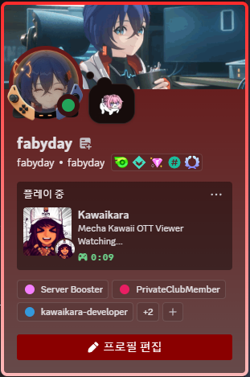

# *카와이카라*

<p align="center">
  
</p>
<p align="center">
<strong>카와이카라</strong>는
<strong>일렉트론</strong> 기반
<strong>OTT 뷰어</strong>입니다
</p>

  [](./README.MD)
 [](./README_KR.MD)
  [](./README_JP.MD)
 
 
 
 
 
 [](https://discord.gg/JJs974BX45)
 [](https://github.com/fabyday/kawaikara/releases/1.1.3)
 [](https://github.com/fabyday/kawaikara/releases/latest)
 [](https://github.com/fabyday/kawaikara/releases)
 
 
 

저는 친구들이랑 디코 방송을 하거나 보는 것을 좋아하는 사람입니다. 그런데 디코방송은 몇가지 불편한 점들이 있습니다. 디코의 방송은 하나의 프로그램 창만을 캡쳐할 수 있다는 거죠. OTT를 스트리밍하는데 브라우저(chrome, firefox 등...)를 사용하는 방법도 있지만, 전체화면을 하지 않을 경우 주소창과 같은 불필요한 UI들은 스트리밍 영상의 일정한 부분을 차지할 것입니다. 체감상 이 영역은 꽤 크고 눈에 거슬립니다. 누군가는 친구들과 같이 OTT를 보면서 작업을 하고 싶은 사람이 있을 수도 있죠. 이 작고 귀여운 OTT 뷰어는 그것을
가능하게 만들어줍니다.


## Features

* ~~**유튜브 애드블록**~~ (**제3자 지원 라이브러리**의 개발 중단)
* **PiP** (Picture in Picture)
* **지정한 윈도우 사이즈**에 **전체화면** 보기
* ~~**크롬 확장 프로그램**~~ (**개발 취소**)
* 치지직 광고 없이 보기
* 친구랑 디스코드에서 OTT 보기

## 가능한 OTT들 
- OTT
  - **넷플릭스**
  - **라프텔**
  - **유튜브**
  - **디즈니 플러스**
  - **아마존 프라임**
  - **웨이브**
  - **왓차**
  - **쿠팡플레이** 
  - **티빙**
  - **크런치롤**
- Music
  - **애플 뮤직** 
- streaming
  - **치지직**
  - **트위치**


## 디스코드 활동 상태(Rich Presence)
<p align="center">
    

<p align="center">
     <Strong>귀여운 카와이카라의 디스코드 활동 상태</strong>
</p>
</p>


## DRM 문제

넵, **일렉트론**은 기본적으로 _CDM_ 을 지원하지 않습니다. **castlab**에서 제공하는 다른 **일렉트론**을 포크를 사용하여 제작되었습니다.


# 사용 예시
<p align="center">
  <a href="https://youtu.be/NOlJcX-sri8">
    
  </a>
</p>
<p align="center">
  <Strong>라프텔</Strong> 비디오 스트리밍 예시 <a href="https://youtu.be/NOlJcX-sri8">
</a>
</p>


<p align="center">  
<br>
    
    
</p>
<p align="center">
  <Strong>라프텔</Strong> 기본모드(좌), 풀 스크린 모드(우) 
</p>

<p align="center">  
    
</p>

<p align="center">
    <Strong>넷플릭스</strong> Rebel Moon.
</p>

<p align="center">  
    
</p>
<p align="center">
  <Strong>디스코드 스트리밍<br></Strong> (기본 모드)
</p>


<p align="center">  
    
</p>
<p align="center">
  <Strong>디스코드 스트리밍<br></Strong> (풀스크린 모드)
</p>


## 사용법 


<p align="center">  
    
</p>
<p align="center">
  <Strong>Tab</Strong>키를 눌러서 메뉴를 여세요
<br>
</p>

1. ```Tab``` 키를 눌러서 메뉴 열기
2. 원하는 서비스 선택하기
3. 즐기기

* 메뉴 열기 : ```Tab```
* 전체화면 On/Off : ```Alt+Enter```


## 카와이카라 뷰어 직접 빌드하기(Windows 10/11)

직접 제작은 간단합니다. 일단 **nvm**(node version manager)를 설치하고 최신버전의 node를 설치해주세요. 그냥 **node.js**환경만 갖춘다면 충분합니다. 그 이후 **yarn**을 설치해주세요. 자세한 사항은
구글 검색을 통해서 알아서 하시면 됩니다. 저는 **nvm**을 사용하여 
node환경을 먼저 설정하는 것을 __강력하게__ 추천드립니다.


설치를 시작하기 전에 **castlab**의 id를 만들어야 합니다. 이것은 **electron**이 google의 drm을 풀어주는 widevine을 내장하지 않아서
그런 것이라고 합니다. 

이것은 **python** 환경을 필요로 하니, **conda**를 설치해 주도록 합니다.(miniconda로 설치를 적극 추천드립니다.)

아래의 코드를 따라 치시면 됩니다.

castlab 계정 생성하기.
```shell
# 콘다 가상 환경 설정 및 castlab 라이브러리 다운로드
conda create -n test_env python=3.10
conda activate test_env
pip install castlabs_evs

#계정 생성
python -m castlabs_evs.account signup

# 컴퓨터를 castlab에 로그인 시킵니다.
python -m castlabs_evs.account reauth -A ${your_account} -P ${your password}

# 진짜 끝!
```

## 디스코드 활동상태 활성화

 프로젝트 최상위 폴더에 ```.env``` 파일을 만드세요.
```
DISCORD_APP_ID=${앱 아이디}
DISCORD_PUB_KEY=${앱 퍼블릭 키}
```


## 자신의 저장소에 직접 배포하기
powershell 에서 아래의 코드를 실행해야 합니다.
인증서를 생성하는 함수는 powershell의 기능을 사용하기 때문입니다.
다음은 실제 프로젝트 디렉토리에서 해야할 일입니다.
```shell 
yarn install # package.json의 모든 library 설치

yarn make-cert:win # 사설(?) 인증서 생성(진짜 인증서는 가격이 꽤 비쌉니다...) 

yarn build # 빌드 시작.

```

## 카와이카라 뷰어 직접 빌드하기(MacOS)

castlab 계정 생성하기.
```shell
# 콘다 가상 환경 설정 및 castlab 라이브러리 다운로드
conda create -n test_env python=3.10
conda activate test_env
pip install castlabs_evs

#계정 생성
python -m castlabs_evs.account signup

# 컴퓨터를 castlab에 로그인 시킵니다.
python -m castlabs_evs.account reauth -A ${your_account} -P ${your password}

# 진짜 끝!
```

powershell 에서 아래의 코드를 실행해야 합니다.
인증서를 생성하는 함수는 powershell의 기능을 사용하기 때문입니다.
다음은 실제 프로젝트 디렉토리에서 해야할 일입니다.
```shell 
yarn install # package.json의 모든 library 설치

yarn make-cert:mac # 사설(?) 인증서 생성(진짜 인증서는 가격이 꽤 비쌉니다...) 

yarn build # 빌드 시작.

```
