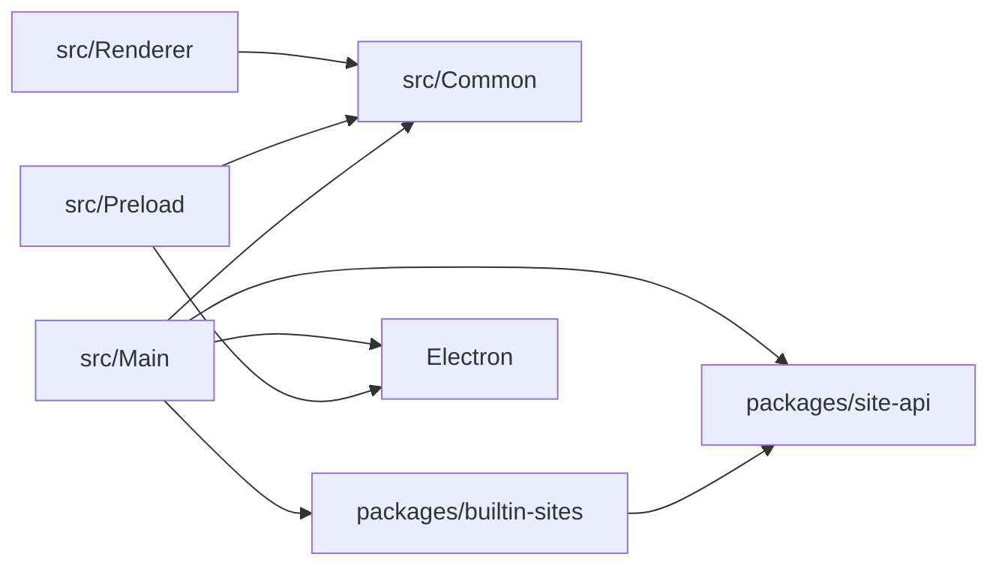
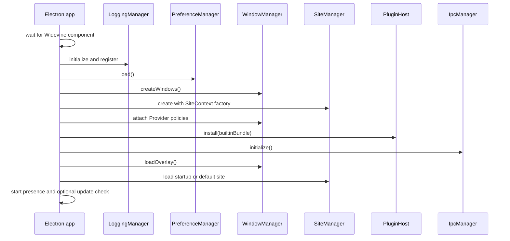

# Architecture Overview

## Main Goals

The `dev` branch, which currently targets version 3.0, separates ownership of the Kawaikara application from ownership of individual site integrations.

- `src` is the application: Electron startup, windows, IPC, preferences, updates, download integration, and UI.
- `packages/site-api` is the stable contract consumed by site plugins.
- `packages/builtin-sites` is the official Bundle shipped with the app.
- Site-specific selectors, login workarounds, user-agent changes, and injected scripts belong to their Provider rather than to a central manager.
- A Provider receives narrow capabilities through `SiteContext` instead of direct access to Electron window objects.

## Repository layout

```text
repository/
├── src/
│   ├── Common/                 # Shared IPC, preferences, build, shortcut, and PiP types
│   ├── Main/
│   │   ├── Main.ts             # Composition root and application lifecycle
│   │   ├── DependencyInjection/ # Manager tokens, construction, and ownership
│   │   ├── Functional/         # Stateless Main-process helpers and platform bridges
│   │   ├── Manager/            # Window, site, IPC, logging, preference, update, and service managers
│   │   ├── Inject/             # Application-owned page injection builders
│   │   └── Plugin/             # PluginHost
│   ├── Preload/                # Restricted bridges for app-owned and remote renderers
│   └── Renderer/
│       ├── Component/          # Reusable application UI
│       └── View/               # Menu, Preference, and Video views
├── packages/
│   ├── site-api/               # Electron-independent plugin contract
│   └── builtin-sites/          # One directory and manifest per Provider
├── stories/                    # Component and view stories with Electron API mocks
└── docs/Developer/             # Developer documentation
```

Directories and files under `Renderer`, `View`, and `Component` use PascalCase to match the project convention.
`src/Main/Main.ts` is intentionally the only file at the `src/Main` root;
implementation files belong to one of its responsibility-based subdirectories.

## Dependency direction



The important rules are:

1. `site-api` does not expose `BrowserWindow`, `WebContents`, `Session`, or other Electron types.
2. `builtin-sites` uses only `site-api` capabilities.
3. Renderer code does not import Main-process managers.
4. Main/Preload/Renderer contracts live in `src/Common`.
5. Remote site pages never receive the full application renderer API.

## Composition root

[`src/Main/Main.ts`](../../../src/Main/Main.ts) is the only place that assembles the runtime.



The app also creates managers for logging, shortcuts, the external downloader, developer links, updates, and Discord Rich Presence. Shutdown runs in the reverse direction: IPC handlers are removed, the global PiP shortcut is unregistered, the active Provider is unloaded, external resources are closed, the log session is finished, and only then does Electron quit.

## Main responsibilities

### WindowManager

- Owns the viewer host, overlay, site `WebContentsView`, popups, and unified PiP window.
- Creates the concrete `SiteContext` capabilities.
- Applies navigation, new-window, PiP, action-URL, and request-header policies from the active Provider.
- Runs external browser login and restores the viewer afterward.
- Redirects supported dropped video files to the internal Video site.
- Emulates the selected app color scheme in active remote site and popup WebContents.
- Keeps HTML media fullscreen inside the configured app window; application fullscreen is a separate explicit action.
- Keeps a lightweight, locale-backed failure document under native site views.
  Ordinary transitions have no interstitial loading copy or spinner and retain
  the outgoing view until native replacement. The active remote view becomes
  visible at main-frame `dom-ready`,
  rather than waiting for every image/iframe to complete `did-finish-load`.
  Provider load promises and policy installation retain their original ordering.
  Stale/detached/internal Video views cannot reveal themselves during a switch,
  and an open app menu retains keyboard focus.
- On a Provider switch, mutes and closes the retired native document without
  waiting for its renderer JavaScript. On same-Provider URL navigation, media
  cleanup still stops subresources first, is bounded to 200 ms, and is restricted
  to the outgoing URL so a late command cannot pause another destination.
- Login cancellation separates credential synchronization from Chrome process
  exit and temporary-profile removal. A handoff waits for credential writes
  already in progress, but process/profile cleanup runs behind the next page.

### SiteManager

- Registers Bundles and validates Provider, Plugin, and profile references.
- Maintains exactly one authoritative Provider and its matching Plugin instances.
  Outgoing instances are captured and retired asynchronously while the new
  Provider starts loading; delayed cleanup cannot clear successor state.
  Page hooks and UA/header policy authority are revoked synchronously first.
  Retired context capabilities reject navigation, internal-view changes, login,
  cookie changes, reinjection, and identity changes; repeated old login close is
  inert. Shared cookies/cache are preserved, not reset to accelerate switching.
- Resolves the site locale and Electron Session profile.
- Forwards policy hooks to the active Provider.
- Reloads the current site when its browser-profile assignment changes.
- Reports loading/ready/failed states around the complete serialized transition,
  including context creation and activation. Outgoing async teardown is not a
  prerequisite for activation. A failed menu-driven switch
  reopens the existing menu so retry remains accessible. Transition status lives
  in the app, not in individual Providers or their authenticated documents.

`pnpm transitions:test:unit` checks lifecycle ordering and stale-view guards.
`pnpm transitions:test:dom` uses a loopback page with a deliberately stalled
image to verify native presentation before full load, failure-only feedback,
and bounded outgoing cleanup, without loading real sites or installed
application profiles.
`pnpm transitions:test:handoff` drives both real managers and native views with
generated decoded video and deliberately blocked outgoing Plugin, Provider,
renderer-JS, and external-browser cleanup. It asserts the next page is visible
while its own full load is pending, the old native media document is destroyed,
late outgoing capabilities are inert, and shared Session cookies survive.
Use `--minified` to exercise the bundled/serialized runtime path too.

Shutdown, Bundle removal/development reload, and browser-storage resets drain
tracked retired cleanup instead of racing it. Background here means overlapping
async work, not a worker thread: a third-party Plugin performing long synchronous
CPU work in Main can still block Electron and must fix that work independently.

### PluginHost

- Checks `KAWAIKARA_SITE_API_VERSION`.
- Prevents duplicate Bundle installation.
- Installs Bundles through `SiteManager`.

User-installed Bundle discovery and compiled JavaScript loading are handled by `BundleManager`.

### Renderer

- Renders the menu, full-overlay preferences, internal Video view, and external-login status.
- Uses KawaiUI for application-owned controls.
- Accesses Main functionality only through a preload API.
- Is developed independently through Storybook mocks where practical.

## Typed IPC

[`src/Common/IPC.ts`](../../../src/Common/IPC.ts) defines the complete namespace-shaped channel tree with `defineIpcChannels()`.

```ts
export const IPC_CHANNELS = defineIpcChannels({
  sites: {
    list: 'kawaikara:sites:list',
    open: 'kawaikara:sites:open',
  },
  // ...
} as const);

export type IpcChannel = LeafValues<typeof IPC_CHANNELS>;
export type IpcChannels = typeof IPC_CHANNELS;
```

This gives Main and Preload autocomplete for both channel paths and channel literal values. Renderer autocomplete comes from `KawaikaraRendererApi` and `KawaikaraVideoApi`, which type the objects exposed through `contextBridge`.

## Registration decision

Decorators attach metadata to Provider and Plugin classes, but they do not register them globally. Registration is explicit through `defineProvider()`, `definePlugin()`, and `defineBundle()`.

This avoids import-order behavior, shared reflection registries between tests, partial discovery, and ambiguous plugin ownership. It also gives a future external loader one export to validate before installation.

## Current boundary versus future work

The application/package split, explicit Bundle definitions, Provider-scoped Plugin activation, profile isolation, typed IPC, runtime capability enforcement, built-in Bundle, validated third-party `.kawai` installation, and HTTPS archive updates/removal are implemented. `.kawai` is a ZIP container with an application-specific extension. External Bundle code loads and unloads on restart under an explicit trusted-code model. Sandboxing, signature checks, and automatic rollback remain planned work.

## Change rules

- Add the smallest possible capability to `site-api` before exposing a new application function to Providers.
- Do not add site-ID conditionals to `WindowManager` for behavior that belongs to one integration.
- Every listener or external resource started by `load()` must be disposed by `unload()`.
- A breaking contract change requires a `KAWAIKARA_SITE_API_VERSION` increment and migration notes.
- Keep IPC channel names, preload methods, Main handlers, and renderer types in sync.
