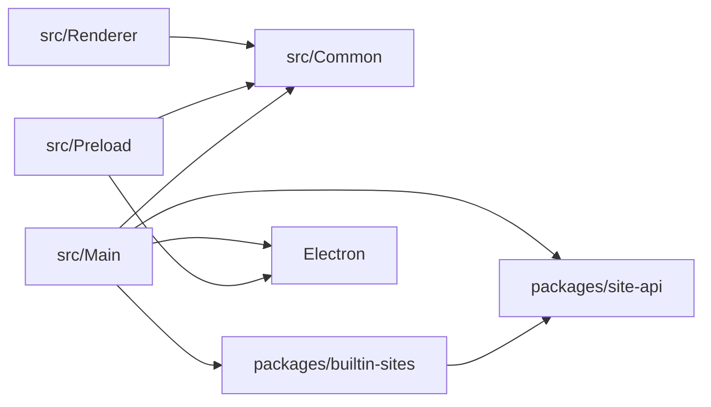
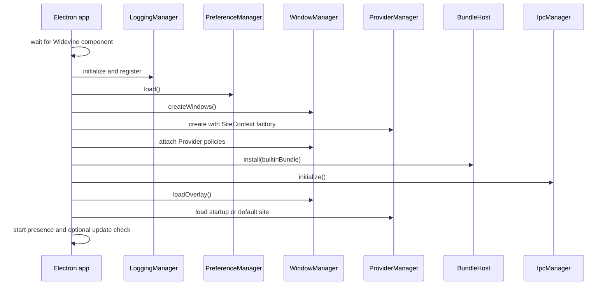

# Architecture Overview

## Main Goals

The `dev` branch, which currently targets version 3.0, separates ownership of the Kawaikara application from ownership of individual site integrations.

- `src` is the application: Electron startup, windows, IPC, preferences, updates, download integration, and UI.
- `packages/site-api` is the stable contract consumed by site plugins.
- `packages/builtin-sites` is the official Bundle shipped with the app.
- Site-specific selectors, login workarounds, user-agent changes, and injected scripts belong to their Provider rather than to a central manager.
- A Provider receives narrow capabilities through `SiteContext` instead of direct access to Electron window objects.

## Repository layout

```text
repository/
├── src/
│   ├── Common/                 # Shared IPC, preferences, build, shortcut, and PiP types
│   ├── Main/
│   │   ├── Main.ts             # Composition root and application lifecycle
│   │   ├── DependencyInjection/ # Manager tokens, construction, and ownership
│   │   ├── Functional/         # Application behavior and reusable Main-process helpers
│   │   ├── Platform/           # Intent-based OS integration and native implementations
│   │   ├── Manager/            # Window, site, IPC, logging, preference, update, and service managers
│   │   ├── Inject/             # Application-owned page injection builders
│   │   └── API/                # BundleHost: site-api Bundle lifecycle integration
│   ├── Preload/                # Restricted bridges for app-owned and remote renderers
│   └── Renderer/
│       ├── Component/          # Reusable application UI
│       └── View/               # Menu, Preference, and Video views
├── packages/
│   ├── site-api/               # Electron-independent plugin contract
│   └── builtin-sites/          # One directory and manifest per Provider
├── stories/                    # Component and view stories with Electron API mocks
└── docs/Developer/             # Developer documentation
```

Directories and files under `Renderer`, `View`, and `Component` use PascalCase to match the project convention.
`src/Main/Main.ts` is intentionally the only file at the `src/Main` root;
implementation files belong to one of its responsibility-based subdirectories.

## Main functional helpers

`src/Main/Functional` groups helpers by responsibility. Keep new helpers in the
matching directory and import the specific module directly. Bundles contain Plugins
and Providers, so their helpers live under `Bundle/Plugin` and `Bundle/Provider`.
Public API names such as `SiteContext` and `SitePagePipeline` retain their existing names.

| Directory | Responsibility |
| --- | --- |
| `App` | Startup, preferences, application data, shortcuts, and IPC validation |
| `Bundle` | Bundle loading, validation, development, and module cache |
| `External` | Browser orchestration, developer links, external requests, and downloader callbacks |
| `Localization` | Application locale catalogs and renderer message contracts |
| `Logging` | Log records and archives |
| `Bundle/Plugin` | Plugin runtime, capabilities, scope, and descriptors |
| `Bundle/Provider` | Provider registration, settings, locale, page pipeline, and site context |
| `Update` | Update state, local feeds, and reversible installation lifecycle |
| `Video` | Video library, mpv hosting, and video effects |
| `Window` | Window orchestration, detachable surfaces, and WebContentsView transfer |
| `Window/PictureInPicture` | PiP policies, placement, visibility, overlays, and subtitles |

## Platform boundary

`src/Main/Platform` owns OS-dependent behavior. Managers and functional helpers call
intent-based functions instead of comparing OS names. `process.platform` may still
be forwarded as diagnostic information or Bundle host metadata.

| Module | Common contract |
| --- | --- |
| `Graphics` | Capture-compatible GPU settings and shipped native-video capabilities |
| `Window/Presentation` | Viewer activation, always-on-top repair, PiP presentation and restoration |
| `Window/ExternalFullscreenMonitor` | Fullscreen ownership monitoring with an explicit unsupported implementation |
| `Storage` | Data locator capabilities, path comparison, and filesystem roots |
| `Keyboard` | Primary shortcut modifier and standard redo policy |
| `Updates` | Installer configuration, native staging, and silent-install policy |
| `External` | Default browser, default video settings, companion discovery/install/launch |
| `Information` | Human-readable operating-system identity |
| `Windows`, `macOS` | Native storage, signature, fullscreen Space, and updater implementations |

Keep application state, preferences, IPC, and user decisions in managers. Platform
code must not import managers or functional application orchestration. A common
contract does not imply identical OS support: unsupported data relocation and
automatic companion installation remain unavailable. Linux currently uses the
existing fallback behavior; native video and desktop integration need separate work.

## Descriptor naming

Declarative Provider and Bundle metadata uses `Descriptor`, for example
`ProviderFileDropDescriptor`, `ProviderSettingsDescriptor`, and
`ShortFormVideoDescriptor`. Internal variables and validators follow the same naming.
The manifest's serialized `contributes` key is unchanged. The site-api package keeps
deprecated type-only aliases for the previous `Contribution` names so existing
Bundle source continues to compile; new code uses `Descriptor`.

## Dependency direction


```mermaid
flowchart LR
  Renderer["src/Renderer"] --> IPC["src/Common"]
  Preload["src/Preload"] --> IPC
  Main["src/Main"] --> IPC
  Main --> SiteAPI["packages/site-api"]
  Main --> Builtin["packages/builtin-sites"]
  Builtin --> SiteAPI
  Main --> Electron["Electron"]
  Preload --> Electron
```

The important rules are:

1. `site-api` does not expose `BrowserWindow`, `WebContents`, `Session`, or other Electron types.
2. `builtin-sites` uses only `site-api` capabilities.
3. Renderer code does not import Main-process managers.
4. Main/Preload/Renderer contracts live in `src/Common`.
5. Remote site pages never receive the full application renderer API.

## Composition root

[`src/Main/Main.ts`](../../../src/Main/Main.ts) is the only place that assembles the runtime.


```mermaid
sequenceDiagram
  participant Electron as Electron app
  participant Logging as LoggingManager
  participant Preferences as PreferenceManager
  participant Windows as WindowManager
  participant Sites as ProviderManager
  participant Bundles as BundleHost
  participant IPC as IpcManager

  Electron->>Electron: wait for Widevine component
  Electron->>Logging: initialize and register
  Electron->>Preferences: load()
  Electron->>Windows: createWindows()
  Electron->>Sites: create with SiteContext factory
  Electron->>Windows: attach Provider policies
  Electron->>Bundles: install(builtinBundle)
  Electron->>IPC: initialize()
  Electron->>Windows: loadOverlay()
  Electron->>Sites: load startup or default site
  Electron->>Electron: start presence and optional update check
```

The app also creates managers for logging, shortcuts, the external downloader, developer links, updates, and Discord Rich Presence. Shutdown runs in the reverse direction: IPC handlers are removed, the global PiP shortcut is unregistered, the active Provider is unloaded, external resources are closed, the log session is finished, and only then does Electron quit.

## Main responsibilities

### WindowManager

- Owns the viewer host, overlay, site `WebContentsView`, popups, unified PiP window, and log viewer.
- Configures log-viewer IPC, appearance, and close policy. Shared native creation,
  docking, focus, sizing, and disposal live in
  `Functional/Window/DetachableWindowSurface`, which has no log-specific dependencies.
  It uses the same `WebContentsViewTransfer` helper as PiP.
- Creates the concrete `SiteContext` capabilities.
- Applies navigation, new-window, PiP, action-URL, and request-header policies from the active Provider.
- Runs external browser login and restores the viewer afterward.
- Redirects supported dropped video files to the internal Video site.
- Emulates the selected app color scheme in active remote site and popup WebContents.
- Keeps HTML media fullscreen inside the configured app window; application fullscreen is a separate explicit action.
- Keeps a lightweight, locale-backed failure document under native site views.
  Ordinary transitions have no interstitial loading copy or spinner and retain
  the outgoing view until native replacement. The active remote view becomes
  visible at main-frame `dom-ready`,
  rather than waiting for every image/iframe to complete `did-finish-load`.
  Provider load promises and policy installation retain their original ordering.
  Stale/detached/internal Video views cannot reveal themselves during a switch,
  and an open app menu retains keyboard focus.
- On a Provider switch, mutes and closes the retired native document without
  waiting for its renderer JavaScript. On same-Provider URL navigation, media
  cleanup still stops subresources first, is bounded to 200 ms, and is restricted
  to the outgoing URL so a late command cannot pause another destination.
- Login cancellation separates credential synchronization from Chrome process
  exit and temporary-profile removal. A handoff waits for credential writes
  already in progress, but process/profile cleanup runs behind the next page.

### ProviderManager

- Registers Bundles and validates Provider, Plugin, and profile references.
- Maintains exactly one authoritative Provider and its matching Plugin instances.
  Outgoing instances are captured and retired asynchronously while the new
  Provider starts loading; delayed cleanup cannot clear successor state.
  Page hooks and UA/header policy authority are revoked synchronously first.
  Retired context capabilities reject navigation, internal-view changes, login,
  cookie changes, reinjection, and identity changes; repeated old login close is
  inert. Shared cookies/cache are preserved, not reset to accelerate switching.
- Resolves the site locale and Electron Session profile.
- Forwards policy hooks to the active Provider.
- Reloads the current site when its browser-profile assignment changes.
- Reports loading/ready/failed states around the complete serialized transition,
  including context creation and activation. Outgoing async teardown is not a
  prerequisite for activation. A failed menu-driven switch
  reopens the existing menu so retry remains accessible. Transition status lives
  in the app, not in individual Providers or their authenticated documents.

`pnpm test integration pip-visibility-and-site-transition.test.cjs` checks lifecycle ordering and stale-view guards.
`pnpm test electron pip-visibility-and-site-transition.electron.cjs` uses a loopback page with a deliberately stalled
image to verify native presentation before full load, failure-only feedback,
and bounded outgoing cleanup, without loading real sites or installed
application profiles.
`pnpm test electron site-handoff.electron.cjs` drives both real managers and native views with
generated decoded video and deliberately blocked outgoing Plugin, Provider,
renderer-JS, and external-browser cleanup. It asserts the next page is visible
while its own full load is pending, the old native media document is destroyed,
late outgoing capabilities are inert, and shared Session cookies survive.
Use `--minified` to exercise the bundled/serialized runtime path too.

Shutdown, Bundle removal/development reload, and browser-storage resets drain
tracked retired cleanup instead of racing it. Background here means overlapping
async work, not a worker thread: a third-party Plugin performing long synchronous
CPU work in Main can still block Electron and must fix that work independently.

### BundleHost

Lives in `src/Main/API/BundleHost.ts`. This stateful host connects the public
`@kawaikara/site-api` Bundle contract to the app runtime. `BundleManager` owns
discovery and storage, `BundleHost` owns registration transactions and rollback,
and `ProviderManager` owns Provider activation. Reusable loading and validation
helpers remain under `Functional/Bundle`.

- Checks `KAWAIKARA_SITE_API_VERSION`.
- Prevents duplicate Bundle installation.
- Installs Bundles through `ProviderManager`.

User-installed Bundle discovery and compiled JavaScript loading are handled by `BundleManager`.

### Renderer

- Renders the menu, full-overlay preferences, internal Video view, and external-login status.
- Uses KawaiUI for application-owned controls.
- Accesses Main functionality only through a preload API.
- Is developed independently through Storybook mocks where practical.

## Typed IPC

[`src/Common/IPC.ts`](../../../src/Common/IPC.ts) defines the complete namespace-shaped channel tree with `defineIpcChannels()`.

```ts
export const IPC_CHANNELS = defineIpcChannels({
  sites: {
    list: 'kawaikara:sites:list',
    open: 'kawaikara:sites:open',
  },
  // ...
} as const);

export type IpcChannel = LeafValues<typeof IPC_CHANNELS>;
export type IpcChannels = typeof IPC_CHANNELS;
```

This gives Main and Preload autocomplete for both channel paths and channel literal values. Renderer autocomplete comes from `KawaikaraRendererApi` and `KawaikaraVideoApi`, which type the objects exposed through `contextBridge`.

## Registration decision

Decorators attach metadata to Provider and Plugin classes, but they do not register them globally. Registration is explicit through `defineProvider()`, `definePlugin()`, and `defineBundle()`.

This avoids import-order behavior, shared reflection registries between tests, partial discovery, and ambiguous plugin ownership. It also gives a future external loader one export to validate before installation.

## Current boundary versus future work

The application/package split, explicit Bundle definitions, Provider-scoped Plugin activation, profile isolation, typed IPC, runtime capability enforcement, built-in Bundle, validated third-party `.kawai` installation, and HTTPS archive updates/removal are implemented. `.kawai` is a ZIP container with an application-specific extension. External Bundle code loads and unloads on restart under an explicit trusted-code model. Sandboxing, signature checks, and automatic rollback remain planned work.

## Change rules

- Add the smallest possible capability to `site-api` before exposing a new application function to Providers.
- Do not add site-ID conditionals to `WindowManager` for behavior that belongs to one integration.
- Every listener or external resource started by `load()` must be disposed by `unload()`.
- A breaking contract change requires a `KAWAIKARA_SITE_API_VERSION` increment and migration notes.
- Keep IPC channel names, preload methods, Main handlers, and renderer types in sync.


## Test suites and temporary files

Tests are classified by the boundary they exercise, not by the Node test runner.
Mixed files split pure logic and mocked component tests from persisted state,
HTTP, native compilation, and packaging checks. Assertions within an integration
scenario remain with that scenario.

| Directory | Scope | Command |
| --- | --- | --- |
| `tests/Unit` | Isolated logic and components with mocked external dependencies | `pnpm test unit` |
| `tests/Integration` | Module lifecycles, persisted state, local HTTP, and API contracts | `pnpm test integration` |
| `tests/Electron` | Isolated Chromium UI, IPC, native windows, and GPU behavior | `pnpm test electron` |
| `tests/Performance` | Large-log diagnostics and performance measurements | `pnpm test performance` |
| `tests/Packaging` | Release configuration, installer generation, NSIS compile checks | `pnpm test packaging` |
| `tests/Native` | C++ detector fixtures using the Windows build tools | `pnpm test native` |
| `tests/Smoke` | Explicitly selected live-site / compiled-app probes | `pnpm test smoke` |

`pnpm test` (default: `node`) builds the workspace packages and runs Unit,
Integration, Packaging, and Native. It does not run Electron, performance, live-site
probes, or the opt-in installer package smoke. Native fixtures require the Windows
C++ build tools; NSIS compile checks skip when the compiler is unavailable.
Electron suite failures are reported as failures; grouping a suite does not imply
that all tests have passed on every host. Performance timings are diagnostics,
not portable speed thresholds. Live-site probes require network access and may
require `CHZZK_VIDEO_URL`; the compiled-app probe also requires a current app build.

Use `node tests/run.cjs electron --list` to inspect a suite without launching it.
A filename selects a subset, for example
`node tests/run.cjs electron log-viewer.electron.cjs`.
The graphics-mode probe runs all three modes when selected.
Root package scripts expose only one test entry point: `pnpm test`. The first
argument selects the suite, followed by optional filenames. `pnpm test --help`
prints usage; `--list` never builds packages or launches tests. Suites that need
compiled workspace packages build them automatically; Unit, Packaging, and
Native run directly. All scratch files remain under `tests/tmp`.

`tests/Helpers/Paths.cjs` provides the project-local `tests/tmp` scratch root.
The runner also sets child-process TEMP, TMP, and TMPDIR there. Each fixture uses
a unique directory. NSIS scripts, compiled fixture EXEs, generated artwork,
optional preview output, and native test binaries stay below this ignored root.
Tests may retain artifacts for diagnosis; none of these fixture installers are
executed automatically. `KAWAI_INSTALLER_PREVIEW=1 pnpm test packaging windows-installer.test.cjs` compiles
an inert preview; `KAWAI_INSTALLER_PACKAGE_SMOKE=1 pnpm test packaging windows-installer.test.cjs` explicitly
enables dummy-app packaging. Both remain under `tests/tmp`.
The NSIS compiler is read from NSIS_HOME or the existing electron-builder cache;
it is not copied into the project. Persistent manual update-test builds/profiles
remain under the existing `tests/Release` path.
