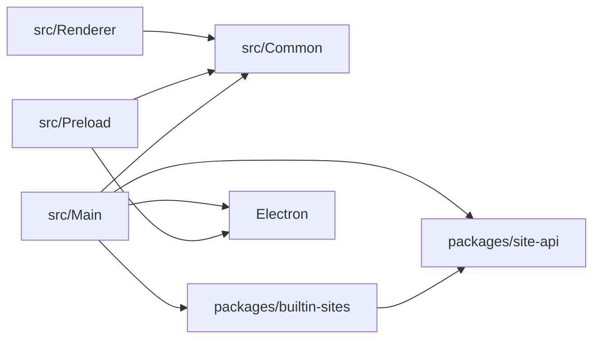
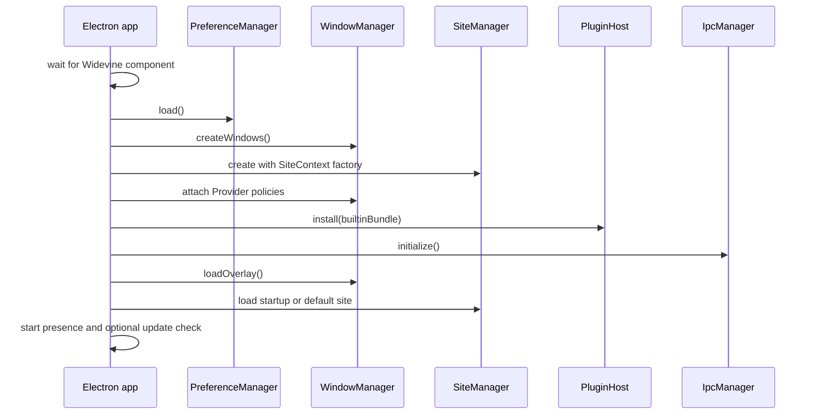

# Architecture Overview

## Main Goals

`dev3` aka version 3.0 separates ownership of the Kawaikara application from ownership of individual site integrations.

- `src` is the application: Electron startup, windows, IPC, preferences, updates, download integration, and UI.
- `packages/site-api` is the stable contract consumed by site plugins.
- `packages/builtin-sites` is the official Bundle shipped with the app.
- Site-specific selectors, login workarounds, user-agent changes, and injected scripts belong to their Provider rather than to a central manager.
- A Provider receives narrow capabilities through `SiteContext` instead of direct access to Electron window objects.

## Repository layout

```text
dev3/
├── src/
│   ├── Common/                 # Shared IPC, preferences, build, shortcut, and PiP types
│   ├── Main/
│   │   ├── Main.ts             # Composition root and application lifecycle
│   │   ├── Manager/            # Window, site, IPC, preference, update, login, and helper managers
│   │   └── Plugin/             # PluginHost
│   ├── Preload/                # Restricted bridges for app-owned and remote renderers
│   └── Renderer/
│       ├── Component/          # Reusable application UI
│       └── View/               # Menu, Preference, and Video views
├── packages/
│   ├── site-api/               # Electron-independent plugin contract
│   └── builtin-sites/          # One directory and manifest per Provider
├── stories/                    # Component and view stories with Electron API mocks
└── docs/Developer/             # Developer documentation
```

Directories and files under `Renderer`, `View`, and `Component` use PascalCase to match the project convention.

## Dependency direction



The important rules are:

1. `site-api` does not expose `BrowserWindow`, `WebContents`, `Session`, or other Electron types.
2. `builtin-sites` uses only `site-api` capabilities.
3. Renderer code does not import Main-process managers.
4. Main/Preload/Renderer contracts live in `src/Common`.
5. Remote site pages never receive the full application renderer API.

## Composition root

[`src/Main/Main.ts`](../../../src/Main/Main.ts) is the only place that assembles the runtime.



The app also creates managers for shortcuts, the external downloader, developer links, updates, and Discord Rich Presence. Shutdown runs in the reverse direction: IPC handlers are removed, the global PiP shortcut is unregistered, the active Provider is unloaded, external resources are closed, and only then does Electron quit.

## Main responsibilities

### WindowManager

- Owns the viewer host, overlay, site `WebContentsView`, popups, and unified PiP window.
- Creates the concrete `SiteContext` capabilities.
- Applies navigation, new-window, PiP, action-URL, and request-header policies from the active Provider.
- Runs external browser login and restores the viewer afterward.
- Redirects supported dropped video files to the internal Video site.
- Emulates the selected app color scheme in active remote site and popup WebContents.
- Keeps HTML media fullscreen inside the configured app window; application fullscreen is a separate explicit action.

### SiteManager

- Registers Bundles and validates Provider, Plugin, and profile references.
- Maintains exactly one active Provider and its matching Plugin instances.
- Resolves the site locale and Electron Session profile.
- Forwards policy hooks to the active Provider.
- Reloads the current site when its browser-profile assignment changes.

### PluginHost

- Checks `KAWAIKARA_SITE_API_VERSION`.
- Prevents duplicate Bundle installation.
- Installs Bundles through `SiteManager`.

User-installed Bundle discovery and compiled JavaScript loading are handled by `BundleManager`.

### Renderer

- Renders the menu, full-overlay preferences, internal Video view, and external-login status.
- Uses KawaiUI for application-owned controls.
- Accesses Main functionality only through a preload API.
- Is developed independently through Storybook mocks where practical.

## Typed IPC

[`src/Common/IPC.ts`](../../../src/Common/IPC.ts) defines the complete namespace-shaped channel tree with `defineIpcChannels()`.

```ts
export const IPC_CHANNELS = defineIpcChannels({
  sites: {
    list: 'kawaikara:sites:list',
    open: 'kawaikara:sites:open',
  },
  // ...
} as const);

export type IpcChannel = LeafValues<typeof IPC_CHANNELS>;
export type IpcChannels = typeof IPC_CHANNELS;
```

This gives Main and Preload autocomplete for both channel paths and channel literal values. Renderer autocomplete comes from `KawaikaraRendererApi` and `KawaikaraVideoApi`, which type the objects exposed through `contextBridge`.

## Registration decision

Decorators attach metadata to Provider and Plugin classes, but they do not register them globally. Registration is explicit through `defineProvider()`, `definePlugin()`, and `defineBundle()`.

This avoids import-order behavior, shared reflection registries between tests, partial discovery, and ambiguous plugin ownership. It also gives a future external loader one export to validate before installation.

## Current boundary versus future work

The application/package split, explicit Bundle definitions, Provider-scoped Plugin activation, profile isolation, typed IPC, built-in Bundle, and validated third-party `.kawai` installation are implemented. `.kawai` is a ZIP container with an application-specific extension. External Bundles use an explicit trusted-code model and load on restart. Sandboxing, signature checks, permission enforcement, updates, and rollback remain planned work.

## Change rules

- Add the smallest possible capability to `site-api` before exposing a new application function to Providers.
- Do not add site-ID conditionals to `WindowManager` for behavior that belongs to one integration.
- Every listener or external resource started by `load()` must be disposed by `unload()`.
- A breaking contract change requires a `KAWAIKARA_SITE_API_VERSION` increment and migration notes.
- Keep IPC channel names, preload methods, Main handlers, and renderer types in sync.
