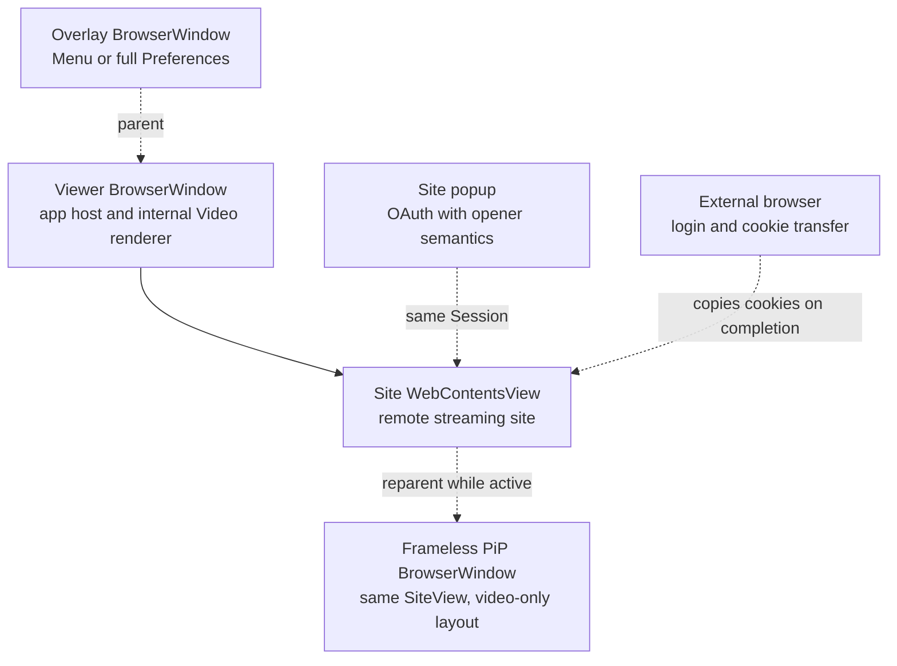
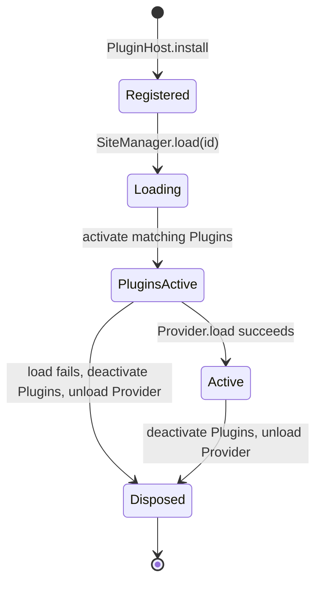
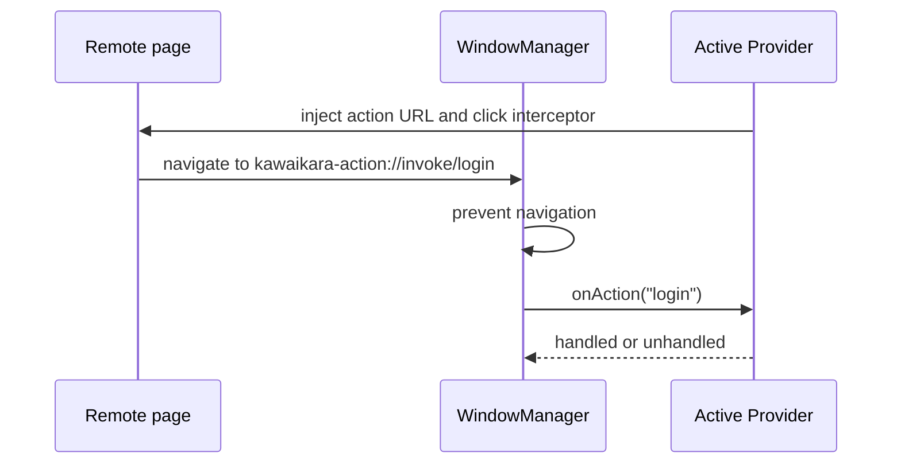

# Runtime and Lifecycle

## Window model

Kawaikara uses separate surfaces for remote content and application-owned UI.



### Viewer and remote SiteView

The main `BrowserWindow` owns application geometry, Dock/task-switcher identity,
native fullscreen, and the app-owned Video renderer. Remote streaming sites fill
a sandboxed child `WebContentsView`; entering Video removes that remote view and
loads the internal document in the main window so the libmpv preload can remain
isolated from remote pages.

When a site changes, Kawaikara:

1. Exits PiP and prepares the current document for removal.
2. Cancels an external login and closes site popups.
3. Unloads the active Provider.
4. Closes the old `WebContentsView`.
5. Creates a new view with the selected Electron Session.
6. Constructs and loads the next Provider.

The view uses `sandbox: true`, `contextIsolation: true`, and `nodeIntegration: false`. `disableHtmlFullscreenWindowResize` prevents a web player's fullscreen control from resizing the entire application window. App-level fullscreen remains an explicit Kawaikara shortcut.

Remote SiteViews receive a Chrome-style user agent without Electron product
tokens before their first navigation. A user-origin scrollbar theme gives every
site the same compact, rounded, activity-only scrollbar; the restricted preload
toggles its visibility marker from captured scroll events.

GPU acceleration is a restart-required General preference and is off by
default. Main reads it synchronously before Electron becomes ready. The disabled
mode calls `app.disableHardwareAcceleration()`, covering Chromium decoding,
compositing, WebGL, WebGPU, rasterization, and platform video overlays on both
macOS and Windows. Enabling it restores the complete GPU path. Changing the
preference opens a confirmation dialog; applying saves all pending preferences,
relaunches Kawaikara, and selects the new mode before the next renderer exists.
`KAWAIKARA_FORCE_SOFTWARE_RENDERING=1` always selects the disabled mode.

Native Video decoding remains independent of Electron's compositor. Main keeps
`MPV_HWDEC=auto-safe` in both modes, so libmpv may continue using VideoToolbox or
D3D11 hardware decoding. With Electron GPU acceleration enabled, frames use the
shared-texture/WebGPU presentation path. With it disabled, libmpv copies the
decoded frames through Canvas 2D. The software surface is limited to CSS
resolution and 720p, and the RGBA IPC path reuses the native buffer's complete
ArrayBuffer instead of making an additional copy. This keeps capture-compatible
playback responsive without changing the hardware decoder selection.

### Overlay

The overlay is a frameless child `BrowserWindow` above the viewer. Its width depends on its current route:

- Menu: compact left-side panel, capped at 380 pixels.
- Preferences: the entire viewer content area.

The gear button changes the overlay route from Menu to Preferences; Preferences is not nested inside the menu panel. The back button, `Escape`, or a non-editing `Backspace` returns to the existing menu without replaying its entry animation. `Tab` remains normal focus navigation while Preferences is open.

While the menu is open, closing on `Escape` and closing on an outside click are independently configurable. Plain `Tab` toggles the menu only when it is not owned by an editable field in the current web content.

### Site popup

A Provider can request a popup when an OAuth service requires `window.opener`, `postMessage`, or `response_mode=web_message`. The popup uses the same Session as the site but receives no application bridge. Laftel's Sign in with Apple flow is the current built-in example.

### External browser

Some services reject embedded Electron login. `ExternalBrowserManager` launches a temporary Chrome/Edge profile through Patchright, waits for a Provider-supplied completion URL pattern, transfers cookies into the selected Electron Session, and restores the viewer.

Completion, cancellation, a site change, or app shutdown closes the browser and removes the temporary profile. Netflix and Coupang Play currently use this path.

This managed login path is intentionally distinct from a normal external link:
cookie import requires a browser context controlled by Patchright, so it tries
Chrome, Edge, and the app-managed Chromium runtime. A Provider's ordinary
`openExternal()` call and the `external` new-window policy use Electron's Main
process shell integration, which delegates HTTP(S) URLs to the default browser
registered by macOS, Windows, or Linux. Default-browser URLs are validated
before dispatch and are never used as a silent substitute for a cookie-import
login flow.

## Browser profiles and Session isolation

The runtime chooses a browser profile in this order:

1. A user assignment for the site (`isolated`, `user:<id>`, or `plugin:<plugin-id>:<profile-id>`).
2. The Provider's `isolation.defaultBrowserProfile`.
3. A persistent profile dedicated to the site.

Partitions are generated as follows:

| Profile | Partition pattern |
| --- | --- |
| Site-specific persistent isolation | `persist:kawaikara.site.<site-id>` |
| Persistent shared profile | `persist:kawaikara.profile.<runtime-profile-id>` |
| Non-persistent shared profile | `kawaikara.profile.<runtime-profile-id>` |

Unsafe characters are replaced with underscores before the partition is used. Sites sharing a partition share cookies, cache, storage, and DRM-related session state, but still receive a new `WebContentsView` when activated.

This model addresses cross-site failures such as a DRM service becoming unusable after visiting another service. Isolation is the default; sharing is an explicit Provider default or user choice. YouTube and YouTube Music intentionally share the built-in `google` Bundle profile.

## Provider and Plugin lifecycle



Only one Provider is active. `SiteManager` waits for the previous Provider's Plugins to deactivate and for its `unload()`, creates the next context and Provider, activates matching Plugins, and calls `load()`. A failed activation or load deactivates already-started Plugins in reverse order before unloading the Provider. Constructors should only store state; external work belongs in `activate()` or `load()`.

The Provider and Plugin base classes each own a `DisposableStore`. Listeners added to `subscriptions` are released by `super.unload()` or `super.deactivate()`.

## URL Provider loading

The built-in `UrlProvider` helper performs:

```text
beforeLoad()
  -> register dom-ready and did-finish-load hooks
  -> viewer.loadURL(url)
  -> afterLoad()
```

An SPA can replace its first document and cause Electron to reject the original navigation with `ERR_ABORTED`. The helper treats only that code as a normal handoff. It invokes `afterLoad()` from both DOM/load events and the resolved `loadURL()` path, so injected code must be idempotent and use a page marker.

## Navigation and new windows

`allowNavigation(url)` guards main-frame navigation and redirects before commit. `onNewWindow(url)` controls `target=_blank` and `window.open()`:

| Policy | Runtime behavior | Typical use |
| --- | --- | --- |
| `viewer` | Load the URL in the current view | Normal same-service navigation |
| `popup` | Create a child window with the site Session | OAuth requiring an opener |
| `external` | Delegate to the operating system | Explicit external documentation or app links |
| `deny` | Ignore the request | Ads or unwanted popups |
| `default` | Allow Electron's default behavior | Compatibility-only escape hatch |

Providers should parse the URL and use exact scheme/hostname allowlists rather than broad substring checks.

## Remote page actions

Remote pages do not receive `ipcRenderer`. When an injected control must request a Main action, the Provider creates a `kawaikara-action://` URL.



`context.actions.createUrl()` validates the action name. Unknown actions return `false`.

## Request-header hook

Each configured Session receives one `onBeforeSendHeaders` listener. Requests are offered to the active Provider and the resolved site locale can set `Accept-Language` afterward.

```ts
onBeforeSendHeaders(details: SiteRequestDetails) {
  if (!isExampleDomain(details.url)) return undefined;
  return { ...details.requestHeaders, 'User-Agent': this.userAgent };
}
```

A shared Session may carry requests for multiple integrations over time. Header hooks must check the hostname and return a new object instead of mutating the original headers.

## Shortcut scope

Application and Provider shortcuts are matched from `before-input-event` in the focused viewer or overlay. Defaults come from `APP_SHORTCUTS` and each Provider's `shortcut.defaultKey`; user overrides are stored in preferences.

- Plain `Tab` does not toggle the menu while the focused web content reports that the user is editing.
- Menu-category shortcuts, defaulting to `1`, `2`, `3`, and so on, exist only while the menu route is visible.
- Menu uses `Tab` as its close toggle without moving focus; Preferences consumes
  it while the fixed Menu underlay remains visible.
- The PiP shortcut is application-local in normal mode.
- Only while PiP is active is its accelerator registered with Electron's `globalShortcut`, allowing restoration even when another application has focus. It is unregistered immediately on exit or shutdown.
- Previous Short/Clip, next Short/Clip, and short-form auto-advance toggle use
  the same local matching in normal mode. While unified PiP is active, those
  three configured accelerators are also registered globally and routed to the
  active YouTube or CHZZK Provider; they are removed with the PiP accelerator.
- A short in-flight/debounce guard prevents one physical key event from triggering both the local and global PiP paths.

Global accelerators may still be unavailable when the operating system, Wine, a game, or another application owns the same key combination. The manager logs that registration failure instead of silently claiming success.

## File-drop redirection

Both app-owned and remote viewer preloads install a capture-phase file drop target. Main validates that a dropped path is absolute, is a real file, and has a supported video extension. It queues a `file:` open request, loads `kawaikara.video`, and delivers the request to the Video renderer. Dropping another file while Video is active follows the same route.

## IPC flow

```text
Renderer view
  -> typed window.kawaikara or window.kawaikaraVideo API
  -> contextBridge preload
  -> ipcRenderer.invoke / event subscription
  -> IpcManager
  -> SiteManager, WindowManager, PreferenceManager, or another manager
```

Adding an IPC operation requires coordinated changes to the channel tree and types, preload implementation, Main handler, and renderer caller. Main handlers also validate values at runtime; TypeScript types do not validate untrusted IPC input.
