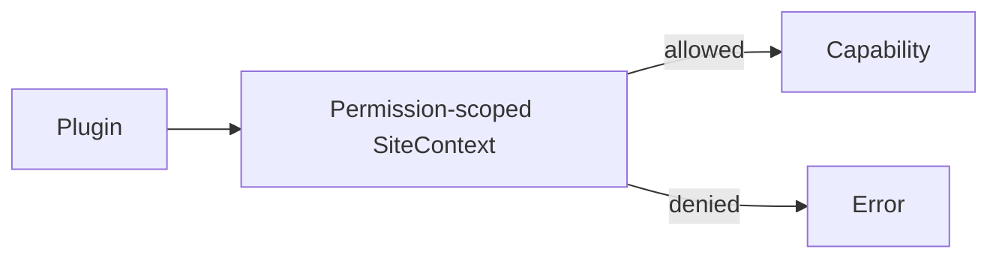

# Security Boundaries

## Baseline

Kawaikara renders untrusted third-party websites inside Electron. The runtime therefore treats remote documents differently from application-owned renderers.

- Node.js is never exposed to a remote site.
- The full Kawaikara IPC API is never exposed to a remote site.
- Main-process operations are presented as narrow capabilities.
- Navigation, new windows, external URLs, and PiP entry pass through descriptor policy.
- Cookies, login, script injection, header interception, and external helper installation are sensitive operations.

## Renderer isolation

Viewer, overlay, and popup web preferences use:

```ts
{
  contextIsolation: true,
  nodeIntegration: false,
  sandbox: true,
}
```

The capability surface still differs by renderer:

| Surface | Preload exposure | Purpose |
| --- | --- | --- |
| Remote SiteView | Restricted viewer preload | File-drop capture, editable-focus reporting, and the internal Video bridge only where applicable |
| Overlay | Typed app preload | App-owned menu, preferences, media, update, and profile operations |
| OAuth popup | No app bridge | Provider page isolated with the current site Session |
| External browser | Separate browser process/profile | Login when embedded authentication is rejected |

The viewer preload must remain small. A helper needed by a remote page is not automatically safe to add to `window`.

## Plugin trust model

`SiteContext` is deliberately narrower than Electron, but the current plugin module is imported into the Main process. It is therefore trusted application code.

> A third-party JavaScript bundle cannot be treated as untrusted merely because its descriptor receives `SiteContext`. If the bundle is imported by Main, it can potentially access Node.js through its own module code.

Before arbitrary user-installed plugins are supported, the project needs a defensible execution model such as a utility process, a proven sandbox, or a declarative integration format. Publisher identity, signature validation, updates, rollback, and user consent also remain unresolved.

## Permission metadata

Descriptors can declare:

- `navigation`
- `internal-view`
- `script-injection`
- `cookies`
- `network-interception`
- `external-browser`

These values are currently descriptive metadata. They do not block a capability call at runtime. The future design must collect consent and supply a permission-scoped context that rejects undeclared operations.



## Script injection

`executeJavaScript()` runs with the target page's authority. Integration code should:

- Never interpolate user input or untrusted DOM text directly into source strings.
- Serialize values with `JSON.stringify()`.
- Install a document marker so repeated DOM/load hooks remain idempotent.
- Inject the smallest possible interceptor instead of a large application runtime.
- Avoid writing passwords, tokens, cookies, or authentication callback data to the DOM or console.
- Restore modified styles, controls, user agents, and listeners during unload or PiP exit.

## Action URLs

`kawaikara-action://invoke/<action>` is input from a remote document.

- `WindowManager` always prevents the navigation itself.
- Only the active descriptor receives the action.
- `createUrl()` rejects malformed action names.
- Unknown actions must return `false`.
- Any future payload needs a schema, size limit, and explicit encoding rules before it is accepted.

## Cookies, profiles, and external login

External login copies cookies from a temporary browser profile into the Electron Session selected for the site. The runtime does not log cookie values and removes the temporary browser profile when the flow ends.

Site-specific persistent isolation is the default. A plugin default or user assignment can intentionally place multiple sites in the same Session. This shares cookies, cache, local storage, and potentially DRM-sensitive state. The preference UI warns when a DRM-marked site is assigned to a shared profile, but does not prohibit the assignment.

For services sensitive to cross-site state, including Netflix-style E100 failures, keep the site isolated unless shared sign-in is known to be safe. OAuth popups use the opener site's Session; they do not create a new shared identity boundary.

## New windows and OAuth

Avoid both extremes of sending every new window to the operating-system browser or allowing every popup.

- Use `viewer` for ordinary same-service navigation.
- Use `popup` only for verified providers that need opener semantics.
- Use `external` only when the OS is intentionally responsible for the URL.
- Use `deny` for unneeded windows.

Allowlist checks must parse the URL and compare protocol and hostname. A substring such as `includes('example.com')` also matches attacker-controlled lookalike domains.

## Downloader installation

The external downloader installer is an application-owned privileged workflow even though it does not request administrator access.

- Manifest and artifacts must use HTTPS.
- Artifacts are restricted to the project's GitHub release path.
- The downloaded file's SHA-256 must match the release manifest.
- On macOS, the app bundle identity is checked before installation.
- Installation is limited to `~/Applications`.
- Existing installations are moved to Trash rather than recursively overwritten.
- Quarantine removal is performed only after an explicit user confirmation and only for the verified download and staged app bundle.

This is not a general-purpose package installer and must not accept arbitrary hosts, paths, bundle IDs, or shell arguments.

## Security review checklist

- Can a remote page invoke a new Main capability directly?
- Are IPC values and URLs validated at runtime?
- Are scheme and hostname checks exact allowlists?
- Are listeners, popups, temporary profiles, timers, object URLs, and injected styles cleaned up?
- Could logs contain a cookie, token, email address, or sensitive URL query?
- Do declared permissions match actual capabilities used?
- Does an error path fall back to a more privileged behavior?
- Does shared Session state create a DRM or authentication interaction between sites?
- Does an installer verify identity and integrity before modifying an application directory?
