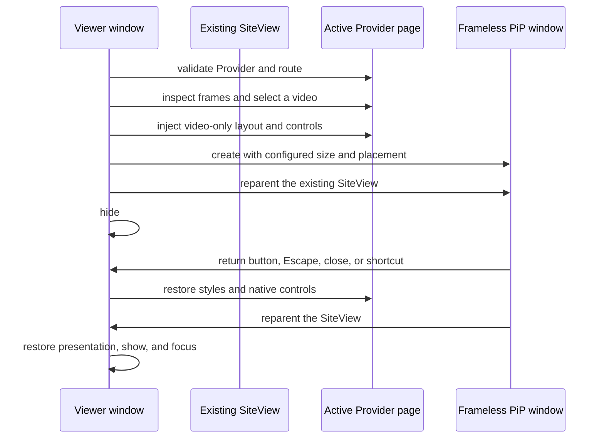

# Unified Picture in Picture

## Why Kawaikara owns the PiP window

Kawaikara intentionally does not use a site's native
`HTMLVideoElement.requestPictureInPicture()` result as its active PiP mode.
Browser-owned PiP cannot reliably provide Kawaikara's configured placement,
custom controls, focus restoration, Provider route policy, or macOS full-screen
Space behavior. It can also leave playback alive after Kawaikara's visible
window has disappeared.

The active implementation is `UnifiedPictureInPictureManager`. Both the normal
and the legacy Game PiP IPC actions are routed to the same unified window mode.
The obsolete browser-native/Game manager was removed so there is only one
runtime policy and cleanup path to maintain.

There are two playback hosts and therefore two related PiP pipelines:

| Source | Normal host | PiP operation | Playback continuity |
| --- | --- | --- | --- |
| Provider site | A sandboxed `WebContentsView` inside the Viewer | Move the existing view into a new frameless `BrowserWindow` | The same document, session, decoder, and media element continue running |
| Internal Video | A child `BrowserWindow` containing the Video renderer | Detach and reshape the existing Video window | The same Chromium/libmpv renderer and playback surface continue running |

Neither path opens the media URL in a second renderer. Reloading or cloning the
page would lose page JavaScript state and can produce a second DRM/media
pipeline.

## Provider PiP lifecycle



Entry is deliberately ordered as follows:

1. `WindowManager` checks Provider and route eligibility.
2. The manager inspects all accessible frames for a ready video. A not-ready
   result is retried once after 100 ms to tolerate a player attaching its media
   immediately after the command.
3. The selected frame receives the reversible video-only transformation.
   Kawaikara always installs its Return and Play/Pause overlay here; this is not
   delegated to Provider injection code.
4. The source aspect ratio selects portrait or landscape preferences and the
   initial monitor bounds.
5. A hidden, frameless PiP `BrowserWindow` is created and all event handlers are
   attached.
6. The existing SiteView is transferred to that window.
7. Only after the target has submitted renderer frames is the Viewer hidden and
   the platform-specific PiP presentation applied.
8. Only after the video fits and paints at the native PiP viewport is the
   Provider subtitle controller initialized and given the saved scale. A slow
   factory or caption layout pass cannot postpone the view transfer or measure
   the old Viewer geometry.
9. The state change is broadcast, which enables the PiP-only global shortcut.

The transfer order is a rendering hack, not incidental bookkeeping.
`transferWebContentsView()` first makes the target native window visible without
activating it, removes the view from its source, sizes the detached view for the
target content rect, adds it to the target, and calls `webContents.invalidate()`.
It then waits for two renderer
animation frames plus one Main-process turn. The frame wait has a 250 ms escape
timeout so an in-flight navigation cannot deadlock cleanup. This avoids the
black or frozen surface seen when the old host was hidden before Chromium had a
visible destination surface.

Provider views are created with `backgroundThrottling: false`. This must be set
when the `WebContentsView` is created: applying a workaround after the transfer
is too late if Chromium or the service has already paused a background media
pipeline. `disableHtmlFullscreenWindowResize: true` also keeps a site's HTML5
full-screen request inside Kawaikara's current host instead of turning the
application itself into a native full-screen window.

## Video discovery and route guards

The manager walks the main frame, accessible child frames, and open shadow
roots. It scores every `<video>` using the following priority:

1. Currently playing and not ended.
2. Having at least `HAVE_CURRENT_DATA`.
3. Visible area inside the frame viewport.

The winning element must also report real `videoWidth` and `videoHeight`.
Missing elements return `no-video`; an element without decoded dimensions
returns `not-ready`.

DOM scoring alone cannot distinguish a real programme from an autoplaying home
page preview. Provider policy is therefore checked before DOM inspection:

- `metadata.pictureInPicture.enabled === true` exposes the shared action.
  Omitted PiP metadata is disabled, so enabling PiP is an explicit capability.
- `AbstractProvider.allowPictureInPicture(currentUrl)` performs route-level
  validation.
- YouTube currently accepts `/watch?v=...`, `/shorts/...`, and `/live/...`.
- CHZZK currently accepts detail routes below `/live`, `/video`, and `/clips`.

A Provider with preview videos should implement a strict route guard even if
its current DOM happens to select the correct element.

## Suppressing page-native PiP

Page-owned PiP is suppressed by default, independently of whether Kawaikara's
shared PiP action is enabled for that Provider. Allowing both paths would let a
site bypass Kawaikara's window state, placement, close, focus, and shortcut
lifecycle.

The application-owned page policy performs several layers of suppression:

- sets `disablePictureInPicture` on current and newly inserted videos;
- reports `document.pictureInPictureEnabled` as false where it can be
  overridden;
- replaces `requestPictureInPicture()` and Document PiP's `requestWindow()`
  with rejected requests;
- immediately exits an unexpected `enterpictureinpicture` event;
- hides, disables, removes from tab order, and blocks clicks/keys on known PiP
  controls;
- observes DOM mutations and open shadow roots so React/Vue player controls
  inserted later are also processed.

CHZZK is the exception to the API-level block. When its SPA leaves a live
route, it moves the stream into a page-owned mini-player and keeps that
detached player responsible for playback and audio. Its Provider declares
`@provider({ pictureInPicture: { pageRequestPolicy: 'allow' } })`: Kawaikara
still hides and blocks trusted user
input on CHZZK's manual page button, but synthetic activation used by the SPA
is allowed and the automatic mini-player remains visible and controllable.
Semantic PiP matching is restricted to interactive controls; matching a
toolbar or mini-player container merely because a descendant contains the word
`PIP` would hide the whole surface while audio continued. `transient` remains
available for sites that need only a short enter/leave cleanup cycle.

Generic selectors and semantic labels cover common English, Korean, and
Japanese PiP controls. A Provider can add service-specific selectors through
the decorator's `pictureInPicture.pageControlSelectors`; CHZZK and Laftel
currently do this. `pictureInPicture.suppressPageControls: false` is an explicit
code-owned escape hatch for a Provider that deliberately implements a compatible
page-owned lifecycle. The manifest only enables the app-level PiP capability.

This policy belongs to the application, not to the Provider's
`script-injection` permission. Providers declare selectors; they do not receive
extra application authority merely to hide their native PiP button. The policy
is refreshed on DOM ready and load completion, while its observer handles later
DOM changes.

## Reversible video-only transformation

The selected element remains in its original DOM, but is visually hoisted into
a fixed, full-window layer. The entry script:

- records the original inline style for the video and each ancestor;
- neutralizes ancestor transforms, filters, clipping, containment, opacity, and
  overflow that could crop the fixed video;
- fixes the selected video to the viewport with `object-fit: contain`;
- hides unrelated body content, media controls, timeline UI, scrollbars, and
  overscroll;
- adds a black backdrop; and
- adds a closed-shadow-root overlay above the site.

The application core supplies a standard DOM-caption selector set covering
Video.js, Shaka, JW Player, THEOplayer, AMP, and common semantic
subtitle/caption container naming for every Provider that enables unified PiP.
Provider methods add stable service-specific selectors for Netflix,
Prime Video, Disney+, Apple TV+, Wavve, Crunchyroll, Twitch, YouTube, and CHZZK.
Native WebVTT cues painted by the selected `<video>` remain visible without a
DOM selector. DOM captions are raised above the video but stay non-interactive,
so they cannot intercept the PiP controls.

### Common subtitle size, automatic alignment, and Provider adapters

Preferences → General → Picture in picture → **PiP subtitle size** stores
`pictureInPictureSubtitleScale` (default `1`, range `0.5`–`3`, or 50%–300%). This is an
absolute multiplier, not pixels: each site's typography remains the baseline.
Old preference files receive 100%. A saved change reaches the current adapter
without restarting PiP and is also applied to the next session.
Out-of-range manual input shows a localized, accessible range warning and is
not saved or silently clamped by the control. Correcting it clears the warning.
Main still clamps finite persisted/IPC values defensively to the same shared bounds.

The App's DOM adapter also owns horizontal center alignment at every scale. Font
size changes alone do not update a player's cached caption-window width, left
coordinate, transform, or `nowrap` rule. The adapter selects the outermost
caption layers (including composed shadow ancestors), centers them within the
displayed video image, and compensates stale horizontal positioning on nested caption windows.
It uses a safe horizontal gutter, centered text, and wrapping for long/unbroken
captions without moving the site's DOM or copying its subtitle markup. It leaves
the player's `position`, `top`, `bottom`, heights, and vertical transforms intact
by default: there is no automatic App-owned bottom baseline. Existing top-anchored
captions stay at their top anchor; bottom-anchored captions grow upward naturally.
The video is fitted and centered consistently; letterbox/pillarbox bars are not
part of the horizontal caption layout area. New cues, video dimension changes, and window
resizes trigger recomputation. Very long captions can still exceed the vertical
space available at the user's selected font scale; the adapter does not silently
reduce that preference.

Providers using the standard helper get this behavior automatically; there is
no alignment declaration in the reflection decorator or another required user
preference. A player with meaningful speaker positions or a custom layout can
opt out inside its implementation with `layout: 'preserve'`, or supply its own
controller. That opt-out preserves placement while still applying the common
font scale.

Providers can override placement with the exported
`PictureInPictureSubtitleAlignment` API inside their controller method. Omitted
`alignment` retains the existing App behavior: horizontal center, vertical
preserve. Omitted axes also retain their defaults. `horizontal: 'preserve'`
and/or `vertical: 'preserve'` explicitly opt out; the older `layout` option
remains supported, but `alignment` takes precedence for any specified axis.
`vertical: 'bottom'` anchors the caption window above the actual displayed
video image, excluding letterbox bars. `bottomInsetRatio` defaults to `0.08`
(clamped to `0`–`0.4`); `minimumBottomInsetPx` defaults to `12` and is capped
at 25% of the displayed image height. The gap is independent of font scale,
so larger/multiple-line captions grow upward from the same baseline.

Use `alignmentSelectors` to identify real caption windows rather than a
full-player container. This path does not rewrite descendant widths,
white-space, overflow, clipping, or scrolling transforms. `scaleMode: 'box'`
visually scales the whole caption window instead of multiplying text font
metrics. It retains the player's cached window height, active visible-row
count, and rolling buffer, preventing hidden previous auto-caption rows from
being exposed. It also leaves player-readable font/line-height metrics
unmultiplied, so subsequent partial cues cannot feed an App-multiplied font
back into the player's layout. Box mode needs caption-window selectors and
preserves the player's own wrapping rules. The regular text adapter remains
the default for other sites.

Centered, bottom-aligned box adapters use persistent selector-based CSS for
positioning/scale, with percentage-translation centering. They do not write
caption-window inline geometry. A player may replace a window or rewrite its
entire inline layout inside its own animation frame: PiP geometry still applies
in that paint, without waiting for the App's next mutation/RAF update. This
avoids both temporary unscaled/misaligned frames and CSS transitions restarted
by resetting transforms and forcing layout. Nested matching windows do not
scale twice. CSS is recomputed for scale/video/window geometry changes and
removed on exit; the player's latest inline styles stay untouched. Inner
rolling transforms, clipping, text rendering, and opacity animations stay
player-owned. Other alignment/text paths retain their reversible inline adapters.
Native text-only and caption-window inline-style mutations need no App layout
pass in this mode. New DOM/Shadow DOM structure, stylesheet/class changes,
scale changes, and video/window geometry changes remain observable.

Box alignment clears player-owned horizontal margins and uses the border box
as the percentage-translation/scale reference. Cached half-width margins must
not be added to the App's `-50%` centering; content-box transforms also shift
padded/bordered windows even when their font multiplier is unchanged. For a
viewport-fitted video, CSS viewport units and the intrinsic aspect ratio derive
image width/height, gutters, and bottom inset through letterbox/pillarbox changes.
They keep centering and the scaled width limit current during a native resize,
even before an App RAF runs. The unscaled width limit is the safe displayed-image
width divided by the subtitle multiplier, so 300% uses the same visible bounds
as 100%. Offset/non-full-window videos retain measured image-relative alignment;
the video box has a ResizeObserver in addition to intrinsic-video/window events.

YouTube opts into centered, bottom-aligned caption windows with an 8% image-height
gap, a 12 CSS-pixel minimum, and box scaling. Netflix and the other built-ins
keep their existing App-default vertical placement. These declarations belong
to Provider implementation methods, not reflection/decorator metadata or a new
user preference.

Built-in services no longer put subtitle selectors in reflection/decorator
metadata. Implement `AbstractProvider.createPictureInPictureSubtitleController`
instead:

```ts
createPictureInPictureSubtitleController(session: ProviderPictureInPictureSession) {
  return session.createDomSubtitleController({
    overlaySelectors: ['.my-player-subtitle-layer'],
    // Optional: explicitly select text when automatic discovery is insufficient.
    textSelectors: ['.my-player-subtitle-text'],
  });
}
```

For a rolling player, an implementation can instead configure:

```ts
return session.createDomSubtitleController({
  overlaySelectors: ['.my-caption-layer'],
  alignmentSelectors: ['.my-caption-window'],
  scaleMode: 'box',
  alignment: {
    horizontal: 'center',
    vertical: 'bottom',
    bottomInsetRatio: 0.08,
    minimumBottomInsetPx: 12,
  },
});
```

This helper is optional. A Provider can instead return any controller exposing
`setScale(scale)` and `dispose()`, including async methods for a player API,
custom layout, or canvas renderer. `session.page.execute(source)` targets the
actual selected player frame and is only available with `script-injection`.
It exposes no Electron objects or privileged remote-page IPC. Providers should
use this scoped executor instead of the context's main/all-frame pipeline for
PiP-specific scripts. Both the session URL and controller are replaced when the
player frame or video changes. Returning `undefined` explicitly opts out; the
base Provider and older bundles use the standard DOM/native-cue helper.

App-owned lifecycle operations are serialized. Exit or frame replacement
cancels pending factory completions, restores the old controller before binding
the next one, and cleans up even when a Provider throws. The App also tracks
helper adapters created by custom factories. Custom factories must clean up
their own non-helper resources if they throw before returning a controller.
Keep `dispose()` idempotent and restore only properties owned by the adapter.

The DOM helper snapshots typography/layout properties, measures all unscaled targets
before writing any ancestor, observes newly rendered text and open shadow
roots, and remeasures on viewport changes. It removes its observers/styles on
exit while restoring original positioning/wrapping and preserving unrelated or newly site-written properties. Explicit
`textSelectors` should identify actual text nodes, not both an inheriting parent
container and its descendant. Native WebVTT resizing uses the active video's
`::cue` rule; `nativeCueFontSize` can specify a site's CSS base size, otherwise
the helper uses the standard approximate `5vh` baseline. At 100% it installs no
font overrides (automatic alignment remains active). Horizontal native WebVTT
cues use cue alignment/position/size settings instead of DOM `text-align`; the
App preserves vertical line positions by default and leaves vertical-writing/region cues
to the player. An explicit Provider bottom alignment also applies a percentage
line/end anchor to ordinary horizontal native cues. Original cue settings and
track listeners are restored on exit. When Chromium does not expose a native
`lineAlign` end-anchor API, native vertical placement remains player-owned;
the adapter does not assign a non-rendering expando property as a substitute.
Cue updates write only changed values because Chromium can emit `cuechange`
when a cue's layout settings change. See the [WebVTT rendering specification](https://www.w3.org/TR/webvtt1/).
Burned-in captions, image/canvas captions, and closed-shadow captions cannot be
resized by DOM font styles; they need a custom Provider/player adapter where
the player supports it. Native cues can be disabled with `nativeCues: false`.

Automatic caption mutations coalesce into one animation-frame layout pass,
not a chain of microtasks that can postpone the resized video's paint. The
observer ignores unrelated page changes, App controls/styles, and unchanged
inline writes. Open shadow roots are cached and rediscovered only when shadow
hosts change; box-mode adapters with explicit window selectors neither scan
every generic caption selector nor discover/measure descendant text fonts.
Caption text, player-owned style changes, new/removed caption windows, and
new shadow roots remain observable, with pending animation frames cancelled
on exit.

Legacy `pictureInPicture.contentOverlaySelectors` remains supported for external
bundles, but is deprecated. The new methods do not expand manifest permissions
or the settings decorator.

Run `pnpm pip:test:unit` for preference/Provider/lifecycle tests and
`pnpm pip:test:dom` for the isolated real-Chromium DOM probe. The probe uses a
fresh temporary profile and never starts the actual Kawaikara application. It
also verifies 200% horizontal centering, stale absolute/nested caption windows,
wrapping, preserved top/bottom anchors and Y transforms, live site positioning
changes, native cue changes, layout opt-out, and restoration.
It additionally verifies YouTube-like rolling buffers through repeated partial
cues at 200% and 300%, no restarted position/scale CSS transitions after partial
updates, same-frame source `style.cssText` resets and caption-window replacement,
player-owned opacity, raised image-relative baselines through letterbox/window resizing,
overlapping window selectors, Provider overrides, native bottom-anchor restoration,
and preservation of the player's clipping heights and source font metrics.
The alignment matrix covers eight PiP dimensions (including presets, square,
portrait, and letterboxing), three source font sizes, and six multipliers from
50% to 300%: 144 combinations with cached player margins and content-box
transform references. It measures both caption-box and fitting-glyph centers
and displayed-image width bounds. Additional native resizes hold App RAFs to
verify responsive centering/gutters/baselines without stale pixel anchors, and
an offset video CSS-box resize verifies the ResizeObserver path.

Run `pnpm pip:test:preferences` for the real React numeric control probe. It
checks both supported boundaries, localized/accessibly associated warnings,
overflow/empty input without preference writes, valid corrections and keyboard
recovery, readable warning colors in both themes, and unchanged behavior for
unrelated numeric preferences. This probe also uses only a fresh temporary profile.

Run `pnpm pip:test:entry` for the real isolated `WebContentsView`/PiP manager
transfer probe. It holds a Provider factory pending and asserts that the native
view and video already fit the PiP viewport before subtitle initialization,
then checks unrelated mutations on a generated 6,000-node page, raised caption
geometry, and style restoration. The probe bounds only its teardown draw-frame
wait because accessory test windows may not deliver teardown RAFs. No real
YouTube/Netflix session or application profile is used.

The transformation also walks composed ancestors across open Shadow DOM
boundaries. Equivalent video/subtitle styles are installed in each accessible
shadow root, including roots added while PiP is active, and removed during
restoration. Closed third-party shadow roots remain intentionally inaccessible;
their native video-painted cues still work, but a DOM caption hidden entirely
inside one requires cooperation from the player.

The closed shadow root prevents service CSS from restyling Kawaikara's Return
and Play/Pause buttons. The video itself is made non-interactive, so hidden
player controls cannot capture clicks.

The overlay also requests Chromium's top layer through a manual popover, with
the maximum-z-index fixed layer retained as a compatibility fallback. When a
site such as Apple TV+ replaces its player iframe during playback, Main
reinjects the same shared overlay and forcibly synchronizes the current native
hover state so both controls are immediately available in the replacement
frame.

The buttons cannot call Electron IPC directly because remote Provider pages
stay sandboxed and do not receive a privileged PiP bridge. Their DOM click
handlers write separate process-randomized sentinels through `console.debug()`;
Main accepts only those exact values from the active SiteView. Main also maps
trusted native mouse-down coordinates over the shared button bounds to the
same actions. That fallback keeps Return and Play/Pause responsive when a DRM
or composited player displays the overlay but does not deliver the DOM click.
The two paths are debounced so one click cannot toggle playback twice.

`Tab` and `Shift+Tab` are consumed while PiP is active so focus cannot move into
hidden page UI or reveal the application menu behind PiP. Plain `Escape`
returns to the Viewer.

Exit restores the original `controls` value, every captured inline style and
marker, and removes all injected nodes. It waits for two animation frames before
the normal page becomes visible again. This wait prevents the restored Viewer
from flashing a partially transformed player.

## Hover and dragging hacks

The overlay buttons appear whenever the pointer is anywhere inside the PiP
window. DOM hover alone is not reliable here: native draggable regions on
Windows can stop delivering mouse movement or emit a transient `mouseLeave`
when crossing into a no-drag button.

Main therefore polls Electron's global cursor position every 80 ms and compares
it with the PiP bounds. Input events may reveal controls early, but the
screen-coordinate check is authoritative for hiding them.

Dragging is platform-specific:

- Windows uses `-webkit-app-region: drag` with explicit no-drag button regions.
- macOS and Linux track Main-process mouse down/move/up input, save the initial
  cursor and window coordinates, and move the native window by the delta.
- Return and Play/Pause hit boxes are excluded from dragging.

This split keeps the whole video surface draggable without sacrificing button
clicks on any supported platform.

## macOS full-screen Space hack

`alwaysOnTop` alone is not enough on macOS. A normal Dock application can have
an always-on-top window on desktop Spaces while still being absent from a true
full-screen Space that already belongs to a game or another application.
Kawaikara applies the following sequence for both Provider and internal Video
PiP:

1. Change the process activation policy from `regular` to `accessory` and hide
   the Dock icon. This makes the PiP behave like a UI-element window instead of
   a competing foreground application.
2. Set the native level to Electron's `screen-saver` always-on-top level.
3. Call `setVisibleOnAllWorkspaces(true, { visibleOnFullScreen: true })`.
4. Pass Electron's native window handle to
   `kawaikara_macos_window_spaces.node`.
5. The AppKit bridge adds `NSWindowCollectionBehaviorCanJoinAllSpaces` and
   `NSWindowCollectionBehaviorFullScreenAuxiliary`, then sets
   `NSScreenSaverWindowLevel` directly.
6. Show the window with `showInactive()` and call `moveTop()`, preserving focus
   in the current game or full-screen application.

AppKit may rewrite collection behavior while transferring a child view,
changing Spaces, or processing focus. Kawaikara therefore reapplies the entire
presentation immediately, after 250 ms, and after 1 second. A PiP `blur` event
schedules the same three reassertions. Timers are cancelled on exit so they
cannot raise a restored or destroyed window later.

The bridge is a small Node-API Objective-C++ add-on compiled as one universal
arm64/x86_64 binary by `pnpm build:native`. `electron-builder` copies it to the
packaged application's `resources/native` directory. On non-macOS platforms
the build script removes stale Mach-O output; at runtime the TypeScript wrapper
is a no-op outside macOS. If the add-on cannot load, Electron's public
all-workspaces behavior remains as a best-effort fallback and a warning is
logged.

Exit reverses the process state before focusing the Viewer: clear
`FullScreenAuxiliary`, remove the all-workspaces/full-screen presentation,
restore activation policy `regular`, show the Dock icon, and only then show and
activate Kawaikara. This order fixes the failure where Kawaikara disappeared
from both the Dock and Command-Tab after returning from PiP.

## Always-on-top and focus state

The user's Viewer always-on-top preference is the desired state, not simply the
current native flag. While either PiP path is active, `WindowManager` clears the
Viewer's native always-on-top flag and cancels its reassert timers. This avoids
two hidden/visible Kawaikara windows competing at the top layer.

Every normal exit, failed entry, navigation exit, and close-button exit restores
the desired Viewer flag. If the preference was enabled, its own reassert logic
is restarted.

The PiP window's native close event is intercepted and converted into Return;
it must never quit the application or leave an invisible page playing audio.
After restoration, `focusViewer()`:

1. restores macOS's regular activation policy and Dock presence;
2. restores a minimized Viewer and shows it;
3. synchronizes SiteView and internal Video bounds;
4. uses `app.focus({ steal: true })` on macOS;
5. calls `moveTop()` and `focus()`; and
6. focuses the active SiteView or Video renderer.

A real main-frame document navigation exits Provider PiP because the injected
element and frame are no longer stable. Same-document SPA navigation remains in
PiP, which is required for YouTube Shorts to change URLs without replacing the
SiteView.

## Internal Video PiP

The local/HLS Video view is already a separate frameless child
`BrowserWindow`, so it cannot use SiteView transfer. The Video renderer reports
whether a playable source is ready plus its decoded dimensions. Entry is
rejected until that state is ready.

On entry, `WindowManager` saves the Video window's minimum size, movable,
resizable, and all-workspaces state. It then hides the overlay, detaches the
Video window from the Viewer, hides the Viewer, applies the selected aspect
ratio and placement, enables moving/resizing, and presents that same window as
PiP. The renderer receives `video.pictureInPictureChanged` and hides its normal
header, errors, and transport controls while adding the PiP Return and
Play/Pause overlay.

On exit, the current placement is recorded, PiP renderer state is cleared, the
window is hidden, and its aspect ratio, native presentation, minimum size,
movable/resizable state, and parent are restored. The Viewer is shown before
the child Video window is returned to its full content bounds. The same macOS
Space and focus restoration sequence is used as Provider PiP.

Closing the Video window while it is in PiP also routes through restoration. In
normal embedded Video mode, closing the child window still follows the Viewer
close lifecycle.

## Size and placement

Landscape and portrait sources have separate preferences. Each supports
compact, medium, large, or validated custom dimensions. The actual source
aspect ratio is preserved where possible and the result is fitted inside the
selected display work area.

Positions are top-left, top-right, bottom-left, bottom-right, or last position.
The monitor source can be the current Viewer display, video/current display,
previous display, or a specific display. Manual movement is stored as normalized
X/Y ratios rather than absolute pixels, allowing the last position to be
reconstructed after resolution, scaling, or monitor changes.

## Shortcut lifetime

In normal mode, the PiP shortcut is handled only from Kawaikara's focused input
events. On successful entry, the same configured accelerator is registered as
an Electron global shortcut. This is necessary because a game, Wine process, or
another application normally owns focus while PiP is visible.

The global registration exists only while PiP is active. It is removed on exit
and application disposal, so it cannot start PiP while another application is
focused in normal Viewer mode. Toggle requests are serialized and inputs within
300 ms are ignored to prevent a key repeat or duplicated local/global event
from entering and immediately exiting.

Games, Wine, macOS, or another process may reserve an accelerator such as
`Command+P`. Electron then reports a registration failure. The failure is
logged, and the user must choose an accelerator not consumed by the foreground
application.

## YouTube Shorts behavior

The YouTube Provider advances to the next Short only after actual completion:

- it handles a normal `ended` event;
- because Shorts commonly loop, it also detects a genuine end-to-start time
  wrap;
- merely reaching the last fraction of a second does not advance;
- the active, mostly visible Shorts video must match the current URL; and
- PiP entry and exit increment a progress generation so a transition cannot be
  mistaken for a completed loop.

Same-document navigation to the next Short keeps the active PiP session attached
to the existing view.

When PiP starts from a visible Menu, `WindowManager` hides both the overlay and
Viewer and remembers that Menu state. Returning restores the Viewer and reopens
the Menu. Preference and update overlays reject PiP entry because their draft
or modal state must remain visible and interactive.

## Failure recovery and invariants

Entry and exit promises are serialized. A second toggle joins the operation
already in progress rather than starting another native-window transfer.

If entry fails after page transformation, cleanup runs in this order: restore
the injected page, transfer the SiteView back, restore macOS application
presentation, destroy the partial PiP window, show the Viewer, and restore its
always-on-top state. Normal exit additionally records placement before changing
window ownership. Renderer-frame synchronization errors are tolerated during
navigation so native cleanup can still complete.

The implementation should preserve these invariants:

- exactly one live playback document or Video renderer exists;
- a SiteView belongs to only one native window at a time;
- page transformation is removed before the normal Viewer is exposed;
- only the active PiP window owns the screen-saver top level;
- macOS activation policy and Dock state are regular outside PiP;
- the PiP global shortcut is registered only while PiP is active; and
- every user-visible close path restores a usable, focused Viewer.

## Known compatibility boundaries

Unified Provider PiP requires an accessible HTML `<video>` in the current frame
tree. A protected surface hidden from JavaScript, canvas-only rendering, a
closed cross-origin implementation detail that Electron cannot inspect, or a
radically changed service DOM can return `no-video`, `not-ready`, or `failed`.
Provider route guards, selectors, and manual regression tests remain part of
each integration.

The macOS bridge targets full-screen Spaces and normal native window levels. It
cannot override protected system UI or a hardware/exclusive presentation path
that the window server does not compose with ordinary application windows.

## Regression checklist

For every Provider PiP change, verify:

- entry and exit from a normal playback route;
- rejection on a home page containing preview videos;
- landscape and portrait sizing;
- Return button, Play/Pause, `Escape`, native close, and configured shortcut;
- resize and drag on macOS and Windows;
- site navigation during PiP and same-document SPA navigation;
- Viewer always-on-top off and on, including restoration after failed entry;
- page-native PiP buttons remain hidden after dynamic player updates;
- no audio remains after closing/returning; and
- macOS desktop Spaces, true full-screen Spaces, Dock, Command-Tab, and focus
  restoration.

For internal Video, repeat the lifecycle with both a local file and HLS source,
and verify that the active Chromium/libmpv rendering backend is not recreated.

## Relevant source files

- `src/Main/Manager/UnifiedPictureInPictureManager.ts`: Provider video
  state transitions, PiP window, transfer, hover, placement, and macOS
  presentation.
- `src/Main/Inject/PictureInPictureVideo.ts` and
  `src/Main/Inject/PictureInPictureControls.ts`: typed page-world operations
  serialized only at the Electron execution boundary.
- `src/Main/Functional/WebContentsViewTransfer.ts`: visible-target transfer and
  renderer-frame synchronization.
- `src/Main/Manager/WindowManager.ts`: Provider/internal Video routing,
  always-on-top ownership, internal Video PiP, navigation, and focus recovery.
- `src/Main/Manager/ShortcutManager.ts`: local/global shortcut lifetime and
  toggle serialization.
- `src/Main/Functional/PagePictureInPicturePolicy.ts`: page-native PiP API and
  control suppression.
- `packages/site-api/src/Provider.ts`: Provider PiP metadata and route contract.
- `src/Main/Functional/MacOSWindowSpaces.ts` and `native/darwin/window-spaces/MacOSWindowSpaces.mm`: native
  macOS full-screen Space bridge.
- `scripts/build-macos-window-spaces.cjs` and `electron-builder.config.cjs`:
  universal add-on build and packaging.
- `src/Renderer/View/Video/App.tsx` and `src/Renderer/Styles/Video.css`: internal
  Video PiP renderer state and overlay.
