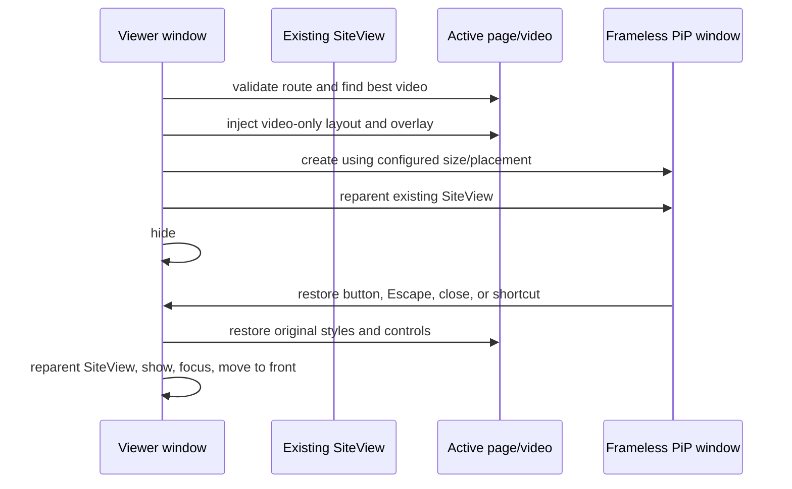

# Unified Picture in Picture

## Current design

The active PiP implementation is `UnifiedPictureInPictureManager`. The previous native/Game PiP implementation remains in the repository as legacy fallback code, but `WindowManager` routes both media IPC actions to the unified manager.

Unified PiP does not use the browser's native `requestPictureInPicture()` window. It creates a dedicated frameless, always-on-top `BrowserWindow` and temporarily moves the existing Site `WebContentsView` into it.

Moving the existing view preserves playback, cookies, JavaScript state, and the decoded video surface. It avoids the black expansion area that occurred when a reduced whole-page view was used as a pseudo-PiP.

## Video selection

The manager walks frames and open shadow roots, scores all `<video>` elements, and selects the best candidate by:

1. Currently playing and not ended.
2. Having current media data.
3. Visible area in the viewport.

The candidate must have real video dimensions. Otherwise the operation returns `no-video` or `not-ready`.

Before inspection, `WindowManager` calls the active descriptor's `allowPictureInPicture(currentUrl)`. Route guards prevent home-page previews from winning selection. Current special cases include:

- YouTube: `/watch?v=...`, `/shorts/...`, or `/live/...`.
- CHZZK: a detail route below `/live`, `/video`, or `/clips`.

## Video-only page transformation

Entry injection:

- Records original inline styles for the selected video and all ancestors.
- Moves the selected video to a fixed full-window layer.
- Hides every unrelated body element.
- Hides HTML media controls and timeline UI.
- Removes root overflow and WebKit scrollbars.
- Adds a black backdrop and an isolated shadow-DOM overlay.

The overlay supplies a full-window drag surface and a Return to Kawaikara button. The button appears while the pointer is over the PiP window. Hover is determined from Electron screen coordinates, avoiding site CSS and hit-testing failures.

Exit restores video controls, every captured inline style, data markers, scroll behavior, and injected nodes. Restoration waits for two animation frames before the normal page is shown again.

## Window behavior

- Frameless, resizable, and always on top. Windows/Linux exclude it from the normal taskbar; macOS keeps the process visible and allows the window over full-screen workspaces.
- Dragging anywhere except the return button moves the PiP window.
- The native close action restores the main viewer instead of quitting or leaving background audio.
- `Escape` restores the viewer.
- The hover return button restores the viewer.
- A real document navigation exits PiP; same-document SPA navigation remains in PiP.
- On exit, macOS activation policy and Dock visibility are restored, the viewer is shown/moved to front/focused, and the SiteView receives focus.

## Size and placement

Landscape and portrait sources have separate preferences. Each supports compact, medium, large, or validated custom dimensions. Actual source aspect ratio is preserved where possible and the result is fitted inside the selected display work area.

Positions are top-left, top-right, bottom-left, bottom-right, or last position. The monitor source can be the current viewer display, video/current display, previous display, or a specific display. Manual movement is saved as normalized X/Y ratios so the last placement can be reconstructed across resolution changes.

## Shortcut lifetime

In normal mode, the PiP shortcut is handled only when Kawaikara receives an input event. On successful PiP entry, the same configured accelerator is registered as an Electron global shortcut. This is required because the user may focus a game or another app while the PiP window remains visible.

The global registration is removed immediately when PiP exits and during application disposal. It is not intended to toggle PiP from another application while Kawaikara is in normal viewer mode.

Games, Wine, macOS, or another process may reserve an accelerator such as `Command+P`. Electron then returns a registration failure. Users should choose an accelerator not consumed by the foreground application.

## YouTube Shorts behavior

The YouTube descriptor advances to the next Short only after actual completion:

- It handles a normal `ended` event.
- Because Shorts commonly loop, it also detects a genuine end-to-start time wrap.
- Merely reaching the last fraction of a second does not advance.
- The active, mostly visible Shorts video must match the current URL.
- PiP entry and exit increment a progress generation so a transition cannot be mistaken for a completed loop.

Same-document navigation to the next Short keeps the active PiP session attached to the existing view.

## Known compatibility boundary

Unified PiP relies on being able to identify and restyle an HTML `<video>` in the current frame tree. A service using an inaccessible protected surface, non-video canvas rendering, or a radically changed DOM can return `no-video`, `not-ready`, or `failed`. The descriptor route guard and manual regression testing remain part of each site integration.
