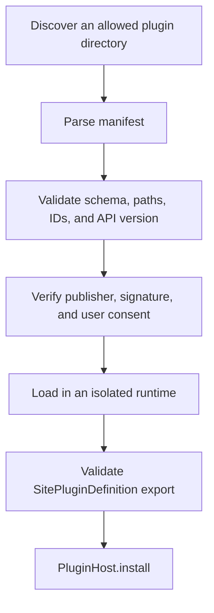

# Plugin Packaging and Distribution

## Current development model

`@kawaikara/site-api` is currently a private workspace package rather than a published registry package. New integrations are therefore developed inside the Kawaikara workspace.

```text
packages/
└── example-sites/
    ├── package.json
    ├── tsconfig.json
    └── src/
        ├── Index.ts
        └── ExampleSite.ts
```

Example `package.json`:

```json
{
  "name": "@example/kawaikara-sites",
  "version": "1.0.0",
  "private": true,
  "main": "dist/Index.js",
  "types": "dist/Index.d.ts",
  "files": ["dist"],
  "scripts": {
    "build": "tsc -p tsconfig.json",
    "typecheck": "tsc --noEmit -p tsconfig.json"
  },
  "dependencies": {
    "@kawaikara/site-api": "workspace:*"
  },
  "devDependencies": {
    "typescript": "^5.8.3"
  }
}
```

Example entry point:

```ts
import { definePlugin } from '@kawaikara/site-api';
import { ExampleSite } from './ExampleSite';

export const plugin = definePlugin({
  id: 'example.streaming-sites',
  name: 'Example Streaming Sites',
  version: '1.0.0',
  apiVersion: 1,
  sites: [ExampleSite],
});

export default plugin;
```

To install this package today, add it to the app's workspace dependencies, build it before the app, import its definition from application composition code, and call `PluginHost.install()`. This requires rebuilding Kawaikara.

The official `packages/builtin-sites` package follows the same contract. Each site has its own file under `src/Sites`, while `src/Index.ts` combines those classes into one plugin definition.

Sites may declare `address: { hosts: [...] }` in their `@site` metadata. These
hosts opt the descriptor into the shared Menu address bar; exact and subdomain
matches are accepted over HTTPS, and the most specific host wins. A site may
also declare `menu.panel` to select an application-approved renderer panel.
The shared panel parent is transparent, so the contributed renderer surface
must provide its own legible background. Arbitrary plugin renderer code is not
loaded by the current in-process development model.

## Planned external package shape

The following shape is a design target, not a supported public contract:

```text
my-plugin/
├── kawaikara.plugin.json
├── dist/
│   └── Index.js
└── assets/
    └── icon.png
```

Possible manifest:

```json
{
  "schemaVersion": 1,
  "id": "example.streaming-sites",
  "name": "Example Streaming Sites",
  "version": "1.0.0",
  "apiVersion": 1,
  "main": "dist/Index.js",
  "permissions": [
    "navigation",
    "script-injection"
  ]
}
```

Do not publish tooling that depends on this draft. The schema, trust policy, signature format, and runtime boundary must be finalized first.

## Planned loader pipeline



Potential source locations are:

- Bundled: a package compiled into the app.
- User-installed: `UserRoot/KawaiData/plugins`.
- Development-only: one explicitly configured repository path.

The development path must never be silently treated as a trusted user-install path in a production build.

## Security requirements for an external loader

Calling `require()` on arbitrary JavaScript from the Main process is not a secure plugin system. Before user installation is enabled, decide:

1. Whether descriptor code runs in a utility process, worker, sandbox, or declarative interpreter.
2. How Node built-ins, native modules, filesystem access, and network access are restricted.
3. How publishers are identified and signatures are verified.
4. How permission consent, denial, and revocation work.
5. Where plugin data lives and how it is removed.
6. How incompatible API versions are disabled without breaking app startup.
7. How plugin updates roll back after a failed load.

## Runtime export validation

A loader must validate values at runtime even when the plugin was written in TypeScript.

- Manifest and exported `id` values match.
- `id`, `version`, and `main` are valid strings.
- The entry path stays inside the plugin directory after resolution.
- `apiVersion` is supported.
- `sites` is an array of constructable descriptors.
- Every descriptor contains valid `@site` metadata.
- Site IDs and plugin profile IDs are unique.
- Descriptor profile references exist in the same plugin.
- Manifest permissions cover the union of descriptor permissions.
- Assets resolve inside an allowed plugin directory or use an explicitly allowed URL scheme.

Compile-time types are developer assistance, not an input validator or security boundary.

## Versioning

- Plugin package versions should follow SemVer.
- `apiVersion` identifies Site API compatibility and is independent of the plugin version.
- A plugin does not need to match the Kawaikara app version.
- Removing or renaming a site ID requires migration for saved default-site, shortcut, ordering, locale-compatibility, and profile-assignment data.

## Distribution checklist

- The bundle contains no credentials, development tokens, or private test URLs.
- It imports the Site API rather than app or Electron internals.
- It declares the correct API version and permissions.
- All listeners, timers, browser sessions, and injected state are cleaned up.
- Paths and URL handling are tested on supported operating systems.
- Failed selectors and navigation policies produce useful but non-sensitive diagnostics.
- Login completion patterns are narrow enough to avoid false completion.
- The plugin remains safe when hooks run more than once.

## Recommended implementation order

1. Freeze and validate a manifest schema.
2. Add a development-only local loader.
3. Enforce a permission-scoped `SiteContext`.
4. Move plugin execution out of the Main process.
5. Add user install, enable/disable, and uninstall UI.
6. Add signing, updates, rollback, and publisher trust.
7. Publish a supported `@kawaikara/site-api` package and compatibility policy.
